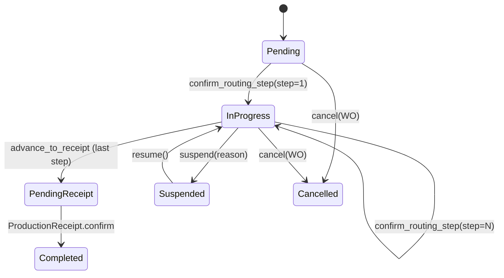

# feat: Implement MES Production Module in abt-core

## Summary

在 `abt-core/src/mes/` 中实现完整的 MES 生产模块，包含 6 个 Service（29 个方法）、7 个实体、枚举、跨模块 stub、数据库迁移。采用扁平子模块结构（与 WMS 一致），跨模块调用通过 stub 隔离。不涉及 gRPC/Proto。

---

## Problem Frame

MES 模块是 ABT 系统的核心生产管理能力，覆盖从生产计划到完工入库的完整流程。当前 `abt-core/src/mes/mod.rs` 仅有占位注释。UML 设计文档 `docs/uml-design/04-mes.html` 已完成详细设计（7 实体 + 6 Service + 11 枚举），需要按设计严格实现。

---

## Requirements

- R1. 实现 ProductionPlanService（5 methods）：计划创建、确认、下达生成工单、查询
- R2. 实现 WorkOrderService（6 methods）：工单创建/下达/关闭/取消，乐观锁并发控制
- R3. 实现 ProductionBatchService（8 methods）：批次创建/拆分、工序报工（confirm_routing_step）、状态机推进、挂起/恢复
- R4. 实现 WorkReportService（4 methods）：只读查询服务 + 计件工资计算
- R5. 实现 ProductionInspectionService（3 methods）：报检创建/查询/记录结果
- R6. 实现 ProductionReceiptService（3 methods）：完工入库创建/确认（含 QMS 硬门 + 倒冲）
- R7. 数据库迁移：7 个主表 + 11 个枚举类型 + 索引 + 幂等约束
- R8. 跨模块 stub 隔离：QMS/OM/WMS/FMS/MasterData 调用通过 stub
- R9. WorkOrderRouting 带 batch_id，每个批次独立工序列
- R10. confirm_routing_step 原子事务：防跳序 Guard + 幂等 + SQL 原子增量 + 自动推进

---

## Scope Boundaries

- 不涉及 gRPC handler / Proto 定义
- 不实现 OM 委外模块（OutsourcingOrder 实体由 OM 管理，MES 通过 stub 调用）
- 不实现 QMS 质量管理（通过 stub 调用）
- suspend/resume 实现状态机转换（BatchStatus 变更），Workflow 审批回调集成延后
- 不实现 BackflushService 实际逻辑（仅 stub）
- `scrap` 方法暂不实现（需审批流集成）

### Deferred to Follow-Up Work

- Proto 定义 + gRPC handler：后续独立 PR
- 审批流集成（Workflow）：待 Workflow 模块完成后对接
- 倒冲实际逻辑：待 BackflushService 实现后替换 stub
- FMS 成本核算对接：待 FMS 模块完成后替换 stub

---

## Context & Research

### Relevant Code and Patterns

- **WMS 模块结构**：`abt-core/src/wms/` — 扁平子模块，每实体一目录（mod/model/repo/service/implt）
- **WMS 枚举模式**：`abt-core/src/wms/enums.rs` — `define_wms_enum!` 宏，SMALLINT(i16) 存储
- **WMS stub 模式**：`abt-core/src/wms/stubs.rs` — 静态方法 + 安全默认值
- **WMS repo 模式**：`abt-core/src/wms/material_requisition/repo.rs` — 原始 sqlx query + PaginatedResult
- **WMS service impl**：`abt-core/src/wms/material_requisition/implt/mod.rs` — Arc<PgPool> + 依赖注入
- **共享层类型**：`abt-core/src/shared/types/` — ServiceContext, DomainError, PaginatedResult
- **数据库迁移**：`abt-core/migrations/` — 纯 SQL 文件，按序编号

### Institutional Learnings

- `docs/solutions/` 中未发现 MES 特定的历史方案

### External References

- 无（项目使用成熟的 sqlx + PostgreSQL 模式，无需外部参考）

---

## Key Technical Decisions

- **枚举使用 SMALLINT(i16) 存储 + 宏生成 boilerplate**：与 WMS 模块一致，复用 `define_wms_enum!` 宏模式（重命名为 `define_mes_enum!`）
- **Service impl 通过 Arc<dyn Trait> 注入依赖**：跨 MES 子服务的调用（如 BatchService 调用 InspectionService）通过构造函数注入
- **confirm_routing_step 单事务原子操作**：Guard + 幂等(SELECT-first) + INSERT work_report + UPDATE routing qty + UPDATE batch status 在同一事务。幂等策略使用 `INSERT ... ON CONFLICT (...) DO NOTHING RETURNING id`，避免唯一约束违反污染 PostgreSQL 事务
- **乐观锁用于 WorkOrder 状态变更**：release/close/cancel 传入 expected_version，不匹配返回 ConcurrentConflict
- **SQL 原子增量用于 completed_qty/defect_qty**：`SET qty = qty + $delta` 避免 read-modify-write
- **ProductionBatch.current_step 由系统自动维护**：业务代码不可直接赋值，仅通过 confirm_routing_step/advance 触发
- **MES stubs 使用本地独立类型**：MES stubs.rs 中定义自己的 `WmsTransactionType`、`WmsRequisitionType` 等类型，不引用 WMS 模块的类型。避免业务模块间编译依赖（遵循 CLAUDE.md 模块依赖规则）
- **循环依赖解决方案**：使用 repo 直调模式。`ProductionPlanService.release_to_work_orders` 直接使用 `WorkOrderRepo` + `ProductionBatchRepo` 创建工单和批次，避免 Service 层循环（Plan→WO→Batch）

---

## Open Questions

### Resolved During Planning

- 代码组织：方案 A（扁平子模块）— 用户确认
- 跨模块调用：stub 隔离 — 用户确认
- 迁移组织：单文件 — 用户确认
- WorkOrderRouting：带 batch_id — 设计文档确认

### Deferred to Implementation

- stub 返回值的具体细节（如 WorkOrderStub.get_info 返回什么默认值）：实现时决定
- 工厂函数的具体签名（lib.rs 中如何暴露）：实现时决定

---

## Output Structure

```
abt-core/src/mes/
  mod.rs
  enums.rs
  stubs.rs
  production_plan/
    mod.rs, model.rs, repo.rs, service.rs, implt/mod.rs
  work_order/
    mod.rs, model.rs, repo.rs, service.rs, implt/mod.rs
  production_batch/
    mod.rs, model.rs, repo.rs, service.rs, implt/mod.rs
  work_report/
    mod.rs, model.rs, repo.rs, service.rs, implt/mod.rs
  production_inspection/
    mod.rs, model.rs, repo.rs, service.rs, implt/mod.rs
  production_receipt/
    mod.rs, model.rs, repo.rs, service.rs, implt/mod.rs

abt-core/migrations/
  003_create_mes.sql
```

---

## High-Level Technical Design

> *This illustrates the intended approach and is directional guidance for review, not implementation specification.*

### ProductionBatch 状态机



### confirm_routing_step 原子事务流

```
1. Guard: current_step == step_no - 1  →  reject if skip
2. Idempotency: check UNIQUE constraint  →  return cached if exists
3. DocSequence(WorkReport) + INSERT work_report
4. SQL atomic: UPDATE work_order_routings SET completed_qty = completed_qty + $delta
5. If is_inspection_point → INSERT production_inspection (IPQC) + suspend batch
6. UPDATE production_batches SET current_step = step_no
7. If last step → auto set status = PendingReceipt
8. Return StepConfirmationResult
```

---

## Implementation Units

### U1. MES Foundation — Enums, Stubs, Module Skeleton

**Goal:** 建立 MES 模块的基础设施：枚举定义、跨模块 stub、mod.rs 骨架声明

**Requirements:** R8

**Dependencies:** None

**Files:**
- Create: `abt-core/src/mes/mod.rs`
- Create: `abt-core/src/mes/enums.rs`
- Create: `abt-core/src/mes/stubs.rs`
- Modify: `abt-core/src/lib.rs`（更新 mes 模块声明）

**Approach:**
- enums.rs：定义 `define_mes_enum!` 宏（复制 WMS 模式），定义全部 11 个枚举（PlanType, PlanStatus, PlanItemStatus, WorkOrderStatus, BatchStatus, RoutingStatus, ShiftType, InspectionType, InspectionResultType, ReceiptStatus, DefectReason）。DefectReason 额外实现 `affect_wage() -> bool` 方法
- stubs.rs：定义 MES 需要的所有跨模块 stub（DocumentSequenceStub, DocumentLinkStub, InventoryReservationStub, AuditLogStub, QmsInspectionStub, WmsInventoryTransactionStub, WmsMaterialRequisitionStub, BackflushStub, CostEntryStub, BomServiceStub, ProductServiceStub）。**关键**：WMS 相关 stub 使用 MES 本地独立类型（如 `WmsTransactionType`），不引用 `abt-core/src/wms/` 中的类型，遵循 CLAUDE.md 模块依赖规则
- mod.rs：声明所有 6 个子模块 + pub use enums::* + pub use stubs::*
- lib.rs：mes 模块已有 `pub mod mes;` 占位，无需修改

**Patterns to follow:**
- `abt-core/src/wms/enums.rs` — define_wms_enum! 宏
- `abt-core/src/wms/stubs.rs` — stub 结构和命名
- `abt-core/src/wms/mod.rs` — 子模块声明模式

**Test scenarios:**
- Happy path: DefectReason::MaterialDefect.affect_wage() == true
- Happy path: DefectReason::OperatorError.affect_wage() == false
- Edge case: 所有枚举的 i16 round-trip（from_i16 / as_i16）

**Verification:**
- `cargo clippy -p abt-core` 无错误

---

### U2. MES Database Migration

**Goal:** 创建 MES 所有数据库对象：11 个枚举类型、7 个主表、索引和幂等约束

**Requirements:** R7, R9

**Dependencies:** None（可与 U1 并行）

**Files:**
- Create: `abt-core/migrations/003_create_mes.sql`

**Approach:**
- 严格按设计文档 `04-mes.html` 中的实体定义创建表
- 所有枚举使用 SMALLINT 约定（与 WMS 一致，不使用 PostgreSQL ENUM type）
- 检查 WMS 迁移 `002_create_wms.sql` 是否包含状态转换定义数据插入（如 `state_transition_defs` 表）。如有，为 MES 的 BatchStatus、WorkOrderStatus、ReceiptStatus 等添加对应的状态转换规则数据
- 关键约束：
  - production_plans.doc_number UNIQUE
  - work_orders.doc_number UNIQUE + deleted_at 软删除
  - production_batches(batch_no, card_sn) UNIQUE
  - work_order_routings(batch_id, step_no) UNIQUE — 防跳序
  - work_reports(batch_id, routing_id, worker_id, shift, report_date) UNIQUE — 幂等
  - work_reports.doc_number UNIQUE
  - production_inspections.doc_number UNIQUE
  - production_receipts.doc_number UNIQUE
- 索引：plan_items(plan_id), work_orders(status, plan_item_id), batches(work_order_id, status, card_sn), routings(batch_id, step_no), work_reports(work_order_id, batch_id)

**Test scenarios:**
- Test expectation: none — 纯 SQL 迁移文件，通过 `sqlx migrate run` 验证

**Verification:**
- 迁移文件 SQL 语法正确
- 与 enums.rs 中的 i16 值一致

---

### U3. ProductionPlan Sub-module

**Goal:** 实现生产计划的完整 CRUD + 确认 + 下达生成工单

**Requirements:** R1

**Dependencies:** U1

**Files:**
- Create: `abt-core/src/mes/production_plan/mod.rs`
- Create: `abt-core/src/mes/production_plan/model.rs`
- Create: `abt-core/src/mes/production_plan/repo.rs`
- Create: `abt-core/src/mes/production_plan/service.rs`
- Create: `abt-core/src/mes/production_plan/implt/mod.rs`

**Approach:**
- model.rs：ProductionPlan, ProductionPlanItem, CreatePlanReq（含 items 数组）, PlanFilter, BatchReleaseResult
- repo.rs：insert（plan + items）, get_by_id（join items）, update_status, list（带 filter）
- service.rs：ProductionPlanService trait（5 methods）
- implt/mod.rs：ProductionPlanServiceImpl，依赖 `Arc<PgPool>` + `Arc<dyn WorkOrderService>`（通过 setter 或 lazy init 解决循环依赖）
- `release_to_work_orders`：遍历 items，每个 item 调用 WorkOrderService.create + BatchService.create，ContinueOnError 模式，收集 BatchReleaseResult
- confirm：Draft → Confirmed 状态校验

**Patterns to follow:**
- `abt-core/src/wms/material_requisition/` — 完整四层结构
- `abt-core/src/wms/material_requisition/implt/mod.rs` — Arc 注入 + DomainError 映射

**Test scenarios:**
- Happy path: create plan with items → confirm → release generates work orders
- Edge case: release with some items failing (ContinueOnError) returns BatchReleaseResult with failures
- Error path: confirm non-Draft plan returns InvalidStateTransition
- Error path: release non-Confirmed plan returns BusinessRule

**Verification:**
- `cargo clippy -p abt-core` 无错误
- ProductionPlanService trait 方法签名与设计文档一致

---

### U4. WorkOrder Sub-module

**Goal:** 实现工单的全生命周期管理，含乐观锁并发控制

**Requirements:** R2

**Dependencies:** U1, U3（WorkOrderService trait 被 ProductionPlanService 引用）

**Files:**
- Create: `abt-core/src/mes/work_order/mod.rs`
- Create: `abt-core/src/mes/work_order/model.rs`
- Create: `abt-core/src/mes/work_order/repo.rs`
- Create: `abt-core/src/mes/work_order/service.rs`
- Create: `abt-core/src/mes/work_order/implt/mod.rs`

**Approach:**
- model.rs：WorkOrder, CreateWorkOrderReq, WorkOrderFilter
- repo.rs：insert, get_by_id, update_status_with_version（乐观锁：`WHERE id = $1 AND version = $2`，`SET version = version + 1`），list
- service.rs：WorkOrderService trait（6 methods）
- implt/mod.rs：WorkOrderServiceImpl
  - `release`：乐观锁校验 → 创建 ProductionBatch(min 1) + WorkOrderRouting（从 BomServiceStub/Routing 获取） → InvRes.reserve(Hard) → MaterialRequisitionStub.create_for_work_order。注意：BomServiceStub 默认返回空 routing 步骤，测试时需 mock 或提供预设数据
  - `close`：校验所有 batch 完成 → InvRes.fulfill/cancel → 更新 WO 状态
  - `cancel`：释放当前 batch Hard 预留 → 发布事件（stub）→ 更新 WO 状态
- completed_qty/scrap_qty 从 ProductionBatch 聚合（query 时计算或由 repo join）

**Patterns to follow:**
- `abt-core/src/wms/material_requisition/` — 四层结构
- 乐观锁模式：`update_status_with_version` 检查 version 行数 == 0 则返回 ConcurrentConflict

**Test scenarios:**
- Happy path: create WO → release (creates batch + routing) → close (all batches done)
- Edge case: release with wrong version returns ConcurrentConflict
- Edge case: close when batches not all completed returns BusinessRule
- Error path: cancel already closed WO returns InvalidStateTransition

**Verification:**
- `cargo clippy -p abt-core` 无错误
- 乐观锁 SQL 正确（version 自增 + WHERE 条件）

---

### U5. ProductionBatch + WorkOrderRouting Sub-module

**Goal:** 实现执行层核心：批次管理 + 工序状态机 + 报工原子事务

**Requirements:** R3, R9, R10

**Dependencies:** U1, U2

**Files:**
- Create: `abt-core/src/mes/production_batch/mod.rs`
- Create: `abt-core/src/mes/production_batch/model.rs`
- Create: `abt-core/src/mes/production_batch/repo.rs`
- Create: `abt-core/src/mes/production_batch/service.rs`
- Create: `abt-core/src/mes/production_batch/implt/mod.rs`

**Approach:**
- model.rs：ProductionBatch, WorkOrderRouting, CreateBatchReq, SplitReq, StepConfirmationReq, StepConfirmationResult
- repo.rs：
  - batch: insert, get_by_id, list_by_work_order, update_status, update_current_step
  - routing: insert_batch（批量插入，从主数据复制）, get_by_batch_and_step, atomic_increment_qty
- service.rs：ProductionBatchService trait（8 methods，不含 scrap）
- implt/mod.rs：ProductionBatchServiceImpl，依赖 `Arc<dyn ProductionInspectionService>`
  - `create`：DocSequence 生成 batch_no + card_sn，创建 batch + 从 BomServiceStub 获取 BOM 展开
  - `split_work_order`：验证 sum(batch_qty) <= planned_qty，创建多个 batch + 各自的 WorkOrderRouting
  - `confirm_routing_step`（核心原子事务）：
    1. 查询 batch，Guard: current_step == step_no - 1
    2. 幂等：INSERT ... ON CONFLICT (...) DO NOTHING RETURNING id，冲突返回已有结果（避免约束违反污染事务）
    3. SQL 原子增量 routing.completed_qty/defect_qty
    4. 若 is_inspection_point → 调用 InspectionService.create(IPQC) + 挂起 batch
    5. 更新 batch.current_step
    6. 若最后工序 → 自动 set status = PendingReceipt
    7. 计算 wage_amount
    8. 返回 StepConfirmationResult
  - `advance_to_receipt`：校验最后工序完成，更新 status = PendingReceipt
  - `suspend` / `resume`：状态校验 + 更新

**Patterns to follow:**
- `abt-core/src/wms/material_requisition/` — 事务内多步操作模式
- WMS InventoryTransaction 的 record 方法 — 跨服务调用模式

**Test scenarios:**
- Happy path: confirm_routing_step step=1 → batch Pending→InProgress, current_step=1
- Happy path: confirm all steps → auto advance to PendingReceipt
- Edge case: skip step (step=3 when current_step=1) → BusinessRule guard rejection
- Edge case: duplicate report (same worker/shift/date/routing) → idempotent, returns existing result
- Edge case: is_inspection_point → batch suspended, inspection created
- Integration: full batch lifecycle (create → step1 → step2 → advance → receipt)

**Verification:**
- `cargo clippy -p abt-core` 无错误
- confirm_routing_step 的 SQL 原子增量语法正确
- 幂等 UNIQUE 约束覆盖所有维度

---

### U6. WorkReport Sub-module

**Goal:** 实现只读报工查询服务 + 计件工资计算

**Requirements:** R4

**Dependencies:** U1, U2

**Files:**
- Create: `abt-core/src/mes/work_report/mod.rs`
- Create: `abt-core/src/mes/work_report/model.rs`
- Create: `abt-core/src/mes/work_report/repo.rs`
- Create: `abt-core/src/mes/work_report/service.rs`
- Create: `abt-core/src/mes/work_report/implt/mod.rs`

**Approach:**
- model.rs：WorkReport, WageSummary, WageDetail, DateRange
- repo.rs：get_by_id, list_by_work_order, list_by_batch, list_by_worker_and_date_range
- service.rs：WorkReportService trait（4 methods）
- implt/mod.rs：WorkReportServiceImpl
  - `calculate_wage`：查询指定 worker + date_range 内的所有 WorkReport，JOIN WorkOrderRouting 获取 unit_price，按公式计算：`(completed_qty + non_operator_defect_qty) * unit_price`
  - 注意：WorkReport 创建由 ProductionBatchService.confirm_routing_step 内部完成，此服务仅提供查询

**Patterns to follow:**
- `abt-core/src/wms/stock_ledger/` — 只读查询服务模式

**Test scenarios:**
- Happy path: list_by_work_order returns reports for given WO
- Happy path: calculate_wage with mixed defect reasons → OperatorError defects excluded from wage
- Edge case: calculate_wage with no reports → returns empty WageSummary with zero total
- Edge case: date range with no matching reports → empty result

**Verification:**
- `cargo clippy -p abt-core` 无错误
- 工资公式正确实现（DefectReason.affect_wage() 控制不良品是否计工资）

---

### U7. ProductionInspection Sub-module

**Goal:** 实现生产报检的 CRUD + 结果记录

**Requirements:** R5

**Dependencies:** U1, U2

**Files:**
- Create: `abt-core/src/mes/production_inspection/mod.rs`
- Create: `abt-core/src/mes/production_inspection/model.rs`
- Create: `abt-core/src/mes/production_inspection/repo.rs`
- Create: `abt-core/src/mes/production_inspection/service.rs`
- Create: `abt-core/src/mes/production_inspection/implt/mod.rs`

**Approach:**
- model.rs：ProductionInspection, CreateInspectionReq, InspectionFilter
- repo.rs：insert, get_by_id, update_result
- service.rs：ProductionInspectionService trait（3 methods）
- implt/mod.rs：ProductionInspectionServiceImpl
  - `create`：DocSequence 生成编号 + INSERT
  - `record_result`：更新 result + qualified_qty + unqualified_qty

**Patterns to follow:**
- `abt-core/src/wms/arrival_notice/` — 简单 CRUD 服务模式

**Test scenarios:**
- Happy path: create inspection → record_result(Pass)
- Error path: record_result on non-existent id → NotFound

**Verification:**
- `cargo clippy -p abt-core` 无错误

---

### U8. ProductionReceipt Sub-module

**Goal:** 实现完工入库：创建 + 确认（含 QMS 硬门 + 倒冲 + 成本 + 释放预留）

**Requirements:** R6

**Dependencies:** U1, U2, U5, U7

**Files:**
- Create: `abt-core/src/mes/production_receipt/mod.rs`
- Create: `abt-core/src/mes/production_receipt/model.rs`
- Create: `abt-core/src/mes/production_receipt/repo.rs`
- Create: `abt-core/src/mes/production_receipt/service.rs`
- Create: `abt-core/src/mes/production_receipt/implt/mod.rs`

**Approach:**
- model.rs：ProductionReceipt, ReceiptFilter
- repo.rs：insert, get_by_id, list, update_status
- service.rs：ProductionReceiptService trait（3 methods）
- implt/mod.rs：ProductionReceiptServiceImpl，依赖 `Arc<dyn ProductionBatchService>`
  - `create`：校验 batch status = PendingReceipt，DocSequence 生成编号 + INSERT
  - `confirm`（核心事务）：
    1. QmsInspectionStub.is_passed(FQC) → 失败返回 BusinessRule
    2. WmsInventoryTransactionStub.record(ProductionReceipt)
    3. CostEntryStub.record(成品入库成本)
    4. BackflushStub.execute() → 失败仅 log，不阻断
    5. CostEntryStub.record(差异成本)
    6. InventoryReservationStub.fulfill/cancel(释放 Hard)
    7. 更新 batch.status = Completed
    8. 更新 receipt.status = Confirmed

**Patterns to follow:**
- `abt-core/src/wms/material_requisition/implt/mod.rs` — 事务内多步跨服务调用模式

**Test scenarios:**
- Happy path: create receipt → confirm → batch completed, reservation released
- Error path: QMS FQC not passed → BusinessRule blocks confirm
- Edge case: confirm receipt for batch not in PendingReceipt → BusinessRule
- Integration: full flow (batch advance_to_receipt → create receipt → confirm)

**Verification:**
- `cargo clippy -p abt-core` 无错误
- confirm 流程步骤完整（设计文档 7 步全部覆盖）

---

### U9. Module Wiring and Verification

**Goal:** 将所有子模块的 impl 通过工厂函数连接，更新 mod.rs，确保整体编译通过

**Requirements:** R1-R6

**Dependencies:** U3, U4, U5, U6, U7, U8

**Files:**
- Modify: `abt-core/src/mes/mod.rs`
- Modify: `abt-core/src/lib.rs`（如需暴露工厂函数）

**Approach:**
- 在 mes/mod.rs 中添加工厂函数（如 `create_production_plan_service(pool) -> Arc<dyn ProductionPlanService>`），处理服务间依赖注入
- 处理循环依赖：ProductionPlanService 需要 WorkOrderService，WorkOrderService 需要 ProductionBatchService。解决方案：使用 repo 直调模式 — ProductionPlanServiceImpl 直接持有 `Arc<WorkOrderRepo>` + `Arc<ProductionBatchRepo>`，绕过 Service 层循环
- 确保 `cargo clippy -p abt-core` 通过

**Test scenarios:**
- Integration: 所有工厂函数返回正确的 trait object
- Integration: cargo clippy 全量通过

**Verification:**
- `cargo clippy -p abt-core` 无错误无警告

---

## System-Wide Impact

- **Interaction graph:** MES 模块是 WMS 的下游消费者（领料、入库事务、库存预留）。MES stubs 使用本地独立类型（不引用 WMS 模块类型），避免编译依赖
- **Error propagation:** 所有 MES 服务返回 `Result<T, DomainError>`，gRPC handler 层将映射为 tonic::Status
- **State lifecycle risks:** confirm_routing_step 的原子性依赖数据库事务，部分失败由 ROLLBACK 保护。倒冲失败不阻断入库（异步 DeadLetter）
- **Integration coverage:** stub 替代了所有跨模块调用，集成测试需等待 stub 替换为真实服务后补充
- **Unchanged invariants:** `abt-core/src/wms/stubs.rs` 中已有 WorkOrderStub 被 MES 实现替换后需更新

---

## Risks & Dependencies

| Risk | Mitigation |
|------|------------|
| 服务间循环依赖（Plan→WO→Batch→Inspection） | 使用 repo 直调模式：ProductionPlanService 直接使用 WorkOrderRepo + ProductionBatchRepo，绕过 Service 层循环 |
| confirm_routing_step 事务过长 | 设计文档已明确同步/异步边界；stub 调用均为本地无 IO |
| 迁移文件与枚举 i16 值不一致 | U1 和 U2 可并行开发但需交叉 review |
| stub 返回值不够真实导致集成问题 | stub 返回结构体而非硬编码值，便于后续替换 |

---

## Sources & References

- **Origin document:** [docs/superpowers/specs/2026-05-24-mes-module-design.md](docs/superpowers/specs/2026-05-24-mes-module-design.md)
- **UML design:** [docs/uml-design/04-mes.html](docs/uml-design/04-mes.html)
- **Shared infrastructure spec:** [docs/uml-design/README.md](docs/uml-design/README.md)
- Reference pattern: `abt-core/src/wms/` — WMS module structure
- Reference pattern: `abt-core/src/shared/types/` — DomainError, ServiceContext, PaginatedResult
