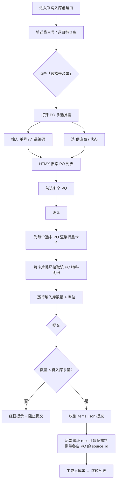

# feat: 入库单创建页支持多来源 PO（弹出多选控件）

## Summary

重新设计 `/admin/wms/stock-in/create`（采购入库模式）的来源单交互：把当前的「单个来源单选择 → 单组物料明细」改为「弹出式 PO 多选控件（单号/供应商/状态/产品编码 4 维过滤 + 多选）→ 每个 PO 一个折叠卡片带出物料明细与待入库余量 → 逐条填入库数量与库位」，最终提交为一个含多来源的入库单。改动集中在创建页前端、一个 PO 搜索端点、后端补 2 个查询字段；列表页/详情页不动。

---

## Problem Frame

实际仓储中，供应商一张【送货单】常包含多个【采购订单 PO】的货物。当前入库创建页是「单对单」：选一个来源单 → 带出一组明细。仓库人员无法在一次入库操作中关联多个 PO，需要分多次建单或丢失送货单与多 PO 的关联关系。

issue #68 要求：保留单个送货单号输入；来源单改为动态增减列表，支持多个 PO；每个 PO 输入后独立带出关联信息（供应商、物料明细、待入库数量）；仓库人员逐条填写入库数量（不超待入库余量）与库位。

用户补充明确：来源单选择改为**弹出式 PO 多选控件**，参考委外单创建页 `/admin/om/outsourcing/create` 的工单选择器结构，支持**单号 + 供应商 + 状态 + 产品编码**四个过滤维度 + 多选。

---

## Requirements

来源：issue #68 正文 + 用户在本会话中的补充指示。

- **R1 — 多来源**：一个入库单可关联多个采购订单 PO（送货单号仍为单个）。
- **R2 — PO 多选弹窗**：来源单通过弹出控件选择，弹窗内提供单号、供应商、状态、产品编码四个过滤维度，支持勾选多个 PO。
- **R3 — 逐单带出**：每选一个 PO，独立带出该 PO 的供应商信息与物料明细（含待入库余量 = 订单数量 − 已收数量）。
- **R4 — 逐条录入**：在带出的明细中，逐条填写入库数量与目标库位。
- **R5 — 数量校验**：入库数量不得超过该明细的待入库余量（硬校验，阻止提交）。
- **R6 — 提交落库**：提交后生成一个入库单（共享 doc_number / delivery_no / 目标仓库），每个物料行携带各自所属 PO 的 source_id / source_doc_number，写入库存事务。

---

## Scope Boundaries

**In scope（本计划执行）：**
- 采购入库模式下，来源单从单选改为弹出式 PO 多选。
- PO 搜索端点（4 维过滤）+ 多选弹窗组件。
- 创建页重设计：PO 折叠卡片明细区 + per-item 库位选择 + 数量硬校验。
- 后端 `PurchaseOrderQuery` 补 `doc_number` + `product_code` 过滤字段。
- 入库提交结构支持 per-item 来源信息。
- 新建页面专用 JS 管理多选交互与明细收集。

**Out of scope（非目标）：**
- 生产入库模式（关联工单完工报工）保持现状，不在本计划改动。
- 来料通知(AN)、手工录入两种来源类型 — 采购入库模式聚焦 PO 多选，AN/手工来源类型移除（原页面的来源类型下拉仅保留对 PO 的多选入口）。
- 入库列表页、入库详情页 — 不变。
- 多 PO 的批量明细查询端点优化 — 首版前端按选中 PO 循环调用现有单 PO 明细端点，可接受 N 次轻量请求；批量端点作为后续可选优化（见 Deferred）。

**Deferred to Follow-Up Work（实现期发现可延后）：**
- 批量 PO 明细带出端点（一次请求返回多个 PO 的明细），减少多选确认时的请求数。
- AN 来源类型的多选支持（若后续业务需要一张送货单关联多个来料通知）。

---

## Key Technical Decisions

**KTD1 — 来源类型聚焦 PO，采购入库模式下不再保留 AN/手工入口。**
理由：issue 核心场景是「送货单含多个 PO」；保留三种来源类型会让多选弹窗与明细带出逻辑需兼容三种来源，复杂度大幅上升且 AN/手工场景在多来源语义下边缘。生产入库模式（工单完工）独立、不受影响。

**KTD2 — 多 PO 明细展示用「每 PO 一个折叠卡片」，不用单一长表。**
理由：issue 明确提到「折叠面板」「逐单核对」；折叠卡片让每个 PO 的供应商/状态/物料聚合在一个视觉单元，仓库人员可逐单展开核对、收起已完成项，符合实际逐单收货节奏。单一长表跨 PO 行交错、核对成本高。

**KTD3 — 数量校验为硬校验（超待入库余量阻止提交）。**
理由：issue 明确「入库数量需校验：不能大于待入库数量」。硬校验在提交时拦截，前端输入时即时红框提示余量超限。

**KTD4 — 库位为 per-item 选择，目标仓库整个入库单统一。**
理由：一张送货单的货物通常入同一仓库，但不同物料/PO 可能落不同库位；目标仓库统一选择后驱动库位下拉范围（该库区下的 bins）。库位默认「按上架策略自动」，可手动覆盖为具体 bin。

**KTD5 — 后端不新增 Service 接口与数据表，仅向后兼容扩展 `PurchaseOrderQuery`。**
理由：`RecordTransactionReq` 已是 per-item 携带 `source_type/source_id/source_doc_number`，`create_stock_in` 已是循环 `record`，天然支持多来源；仅需让前端提交的每个 item 带各自 PO 的 source。`PurchaseOrderQuery` 加 2 个 `Option` 字段，`Default` 不变，不破坏现有调用方与接口契约 —— 符合「接口与模型先行」对改造类工作的要求（无新接口需评审，仅向后兼容模型微调）。

---

## High-Level Technical Design

### 交互流程



### 提交数据结构（方向性，非实现规格）

`items_json` 每个元素需携带所属 PO，使后端每条 `record` 用对的来源：

```
[
  { product_id, batch_no?, quantity, bin_id?,
    source_id: <po_id>, source_doc_number: "PO-xxx" },
  ...
]
```

`source_type` 固定为 `purchase_order`（采购入库模式），无需 per-item 传递。`delivery_no` / `warehouse_id` / `zone_id` / `remark` 仍为整个入库单共享，走普通表单字段。

### 待入库余量

- PO 明细：`待入库余量 = item.quantity − item.received_qty`（来源 `PurchaseOrderItem`）。
- 折叠卡片明细行展示「订单数量 / 已收 / 待入库」三列，入库数量输入框上限锚定待入库余量。

---

## Implementation Units

### U1. 后端：`PurchaseOrderQuery` 补单号 + 产品编码过滤

**Goal：** 让 PO 搜索支持按单号模糊匹配、按产品编码反查包含该产品的 PO，供多选弹窗的 4 维过滤使用（R2）。

**Requirements：** R2

**Dependencies：** 无（基础后端能力，最先做）

**Files：**
- `abt-core/src/purchase/order/model.rs` — `PurchaseOrderQuery` 增加字段
- `abt-core/src/purchase/order/repo.rs` — `list` 的 `where_clause` 与 count/data 两个 query 的 bind 顺序同步
- `abt-core/src/purchase/order/implt.rs` — 仅当 `list` 在 implt 层做字段透传时核对（当前直接透传 query 给 repo）

**Approach：**
- `PurchaseOrderQuery` 增加 `doc_number: Option<String>` 与 `product_code: Option<String>`（均 `Option`，`#[derive(Default)]` 自动为 `None`，向后兼容）。
- `repo.rs::list` 的 `where_clause` 追加两条参数化条件（沿用现有 `($N::T IS NULL OR ...)` 模式）：
  - 单号：`AND ($N::text IS NULL OR doc_number ILIKE '%' || $N || '%')`
  - 产品编码（EXISTS 反查 items + products）：`AND ($M::text IS NULL OR EXISTS (SELECT 1 FROM purchase_order_items poi JOIN products p ON p.product_id = poi.product_id AND p.deleted_at IS NULL WHERE poi.order_id = purchase_orders.id AND p.product_code ILIKE '%' || $M || '%'))`
- **关键：** `where_clause` 用 `format!` 拼接、count 与 data 两段 query 各自 `.bind()`，新增 2 个字段必须在两处 query 的 `.bind()` 调用中按相同占位符顺序追加，否则参数错位（现有 supplier/status/order_date 已是此模式，照搬）。

**Technical design（方向性）：**
```
现有:  $1 supplier_id, $2 status, $3 order_date_start, $4 order_date_end, {scope}
新增后: ..., $5 doc_number, $6 product_code  (scope 若触发则再 +1)
count_query 与 data_query 都补 .bind(doc_number).bind(product_code)
```

**Patterns to follow：** `abt-core/src/mes/work_order/repo.rs` 的 `WorkOrderFilter` keyword ILIKE；本文件第 119-166 行现有 supplier/status/order_date 条件与双 query bind 模式。

**Test scenarios：**
- 单号过滤：传入 `doc_number="PO-2026"`，仅返回 doc_number 含该子串的 PO；传入 `None` 返回全部。
- 产品编码过滤：传入 `product_code="ABC"`，仅返回其 items 中含 product_code 含 "ABC" 的 PO；PO 无该产品时不返回。
- 组合过滤：supplier_id + status + doc_number + product_code 同时传入，返回交集。
- 向后兼容：`PurchaseOrderQuery::default()`（新字段为 None）行为与改动前完全一致，不影响现有采购订单列表页、对账、报表等所有调用方。
- 待入库余量来源正确：`list_items` 返回的 `quantity` 与 `received_qty` 字段可正确计算余量（回归现有行为，确保未被误改）。

**Verification：** `cargo test -p abt-core` 通过；`cargo clippy` 无新增警告；采购订单列表页（`/admin/purchase/orders`）行为不变。

---

### U2. 后端：入库提交支持 per-item 来源

**Goal：** 让 `create_stock_in` 从每个提交的物料行读取其所属 PO 的 `source_id` / `source_doc_number`，而非沿用全局单一 source（R1, R6）。

**Requirements：** R1, R6

**Dependencies：** 无（与 U1 并行）

**Files：**
- `abt-web/src/pages/wms_stock_in_create.rs` — `StockInItemWeb` 扩展 + `create_stock_in` 循环逻辑

**Approach：**
- `StockInItemWeb` 增加字段：`source_id: String`、`source_doc_number: Option<String>`（与现有 `product_id`/`quantity`/`bin_id` 同为字符串，前端 JS 序列化）。
- `create_stock_in`：移除当前「全局 `source_id` / `source_doc_number` 对所有 item 生效」的赋值，改为循环内从每个 `item.source_id` / `item.source_doc_number` 取值；`source_type` 固定 `purchase_order`（采购入库模式）。
- `RecordTransactionReq` 不变 —— 它本就 per-item 带 source，只是当前前端没填 per-item source，现在补上。
- 保留 doc_number（入库单号，全单统一）、delivery_no（送货单号，全单统一）、warehouse_id/zone_id（全单统一）的全局逻辑。

**Patterns to follow：** 现有 `create_stock_in` 的 record 循环与 `RecordTransactionReq` 组装；委外页 `materials_json` 的 per-item 解析（`serde_json::from_str` + 校验）。

**Test scenarios：**
- 多来源提交：items_json 含 3 条物料，分属 2 个不同 PO（source_id 不同），提交成功，生成同一 doc_number 的 3 条库存事务，各自 source_id/source_doc_number 正确。
- 空/非法 source_id：source_id 缺失或非数字时返回明确校验错误（沿用现有 `parse` + `DomainError::validation`）。
- 数量校验：某条 quantity ≤ 0 时阻止提交（沿用现有校验）。
- delivery_no 共享：3 条物料共享同一个 delivery_no（送货单号）写入。
- 仓库/库位默认：未选库区时自动解析默认 zone/bin 的现有逻辑保持（不回归）。

**Verification：** `cargo clippy` 通过；手动提交一个含 2 个 PO 的入库单，在 `inventory_transactions` 表确认 3 条记录 source_id 各异、doc_number 一致。

---

### U3. 前端：PO 多选搜索端点 + 多选弹窗组件

**Goal：** 提供带 4 维过滤的 PO 搜索端点，与可勾选多选的弹窗 UI（R2）。

**Requirements：** R2

**Dependencies：** U1（搜索端点依赖 `PurchaseOrderQuery` 新字段）

**Files：**
- `abt-web/src/routes/wms_stock_in.rs` — 新增 `StockInPoSearchPath` TypedPath + 路由注册
- `abt-web/src/pages/wms_stock_in_create.rs` — 新增 `search_purchase_orders` handler + 弹窗 modal HTML + 结果/已选 fragment

**Approach：**
- 新增 TypedPath（如 `/admin/wms/stock-in/create/search-po`），handler 接收 `doc_number / product_code / supplier_id / status` query，调 `purchase_order_service().list(ctx, conn, PurchaseOrderQuery{...}, PageParams)`，过滤出可入库状态（`PartiallyReceived` / `Received` / `Confirmed` 等可收货状态，与现有 `get_source_pick` 的状态过滤一致），返回结果行 fragment。
- 弹窗结构参考委外页 `#wo-picker`（`om_outsourcing_create.rs::create_page`）：顶部一排过滤控件（单号 input / 产品编码 input / 供应商 select / 状态 select），中部结果列表区，每个结果行带 **checkbox**（多选）+ PO 单号 + 供应商 + 状态标签 + 订单日期。
- 弹窗底部「已选区」展示当前勾选的 PO，确认按钮把选中 PO 的 `{id, doc_number, supplier_name}` 写入隐藏状态。
- 单号/产品编码用 `hx-trigger="keyup changed delay:250ms"`；供应商/状态用 `change`；统一 `hx-target` 指向结果区，`hx-include` 携带四个过滤控件。
- 弹窗显隐用 Hyperscript（`add/remove .is-open`），纯前端 UI 状态不发后端请求（遵循 abt-web CLAUDE.md）。

**Patterns to follow：** `om_outsourcing_create.rs::search_work_orders` + `work_order_search_results` + `#wo-picker` 弹窗结构；现有 `wms_stock_in_create.rs::get_source_pick` / `source_pick_fragment` 的 PO 列表渲染与供应商名解析（`resolve_supplier_names_map`）。

**Test scenarios（page-test 验证场景）：**
- 弹窗打开：点「选择来源单」弹出弹窗，默认列出可入库 PO。
- 单号过滤：输入单号片段，结果实时收敛。
- 产品编码过滤：输入产品编码，仅返回含该产品的 PO。
- 供应商/状态过滤：下拉选择后结果收敛。
- 多选：勾选 3 个 PO，已选区显示 3 项；取消勾选同步移除。
- 确认：点确认，弹窗关闭，页面出现 3 个 PO 折叠卡片（与 U4 联动）。
- 空结果：过滤无匹配时显示「未找到匹配的采购订单」。

**Verification：** `cargo clippy` 通过；agent-browser `snapshot -i` 验证弹窗结构与过滤交互。

---

### U4. 前端：创建页重设计 — PO 折叠卡片明细 + 库位 + 数量校验

**Goal：** 多选确认后渲染每个 PO 的折叠卡片明细区，支持逐条填入库数量/库位、数量硬校验、整 PO 删除（R1, R3, R4, R5）。

**Requirements：** R1, R3, R4, R5

**Dependencies：** U3（弹窗确认产出选中 PO 列表）

**Files：**
- `abt-web/src/pages/wms_stock_in_create.rs` — `stock_in_create_content` 重构 + 折叠卡片 fragment + per-item 库位下拉
- `abt-web/src/pages/wms_stock_in_create.rs` — `source_items_fragment` 扩展（带待入库余量 + 库位 select）

**Approach：**
- 移除原「来源类型下拉 / 单个来源单号输入 / 单个来源选择按钮 / source-modal（单选）」区块；保留送货单号输入、目标仓库/库区/库位级联（全单统一）、操作员、备注、汇总、提交栏。
- 新增「来源单」区：一个「选择来源单」按钮（打开 U3 多选弹窗）+ 一个空的 PO 卡片容器。
- PO 明细带出：复用现有 `get_source_items` 端点（`StockInSourceItemsPath`，`source_type=purchase`），确认多选后 JS 对每个选中 PO 调用一次，把返回明细渲染进该 PO 的折叠卡片。
- 折叠卡片：标题行（PO 单号 + 供应商 + 状态 + 展开切换 + 删除整卡），展开后一张物料明细小表 —— 列：产品编码 / 产品名 / 规格 / 订单数量 / 已收 / **待入库** / 批次号 / **入库数量(输入)** / **库位(select)**。
- 待入库余量：`source_items_fragment` 需展示 `quantity`、`received_qty`、`quantity − received_qty`（需 `get_source_items` 从 PO item 取 `received_qty`，当前仅取 `quantity`，需扩展）。
- 库位 select：复用页面已预加载的 `all_bins`（按目标库区过滤），per-item 渲染 `<select>`，默认「自动」。
- 数量校验：入库数量输入 `oninput` 即时比对待入库余量，超限红框 + 行内提示；提交时全表扫描，任一超限阻止提交（`onsubmit` 返回 false）。
- 汇总：物料种类 = 所有卡片明细行数之和；入库总量 = 所有 quantity 之和。

**Technical design（方向性）：** `get_source_items` 当前对 purchase 分支返回 `(product_id, quantity)`，需扩为带 `received_qty`（来源 `PurchaseOrderItem.received_qty`），fragment 据此算余量并写入每行 `data-pending` 供 JS 校验读取。

**Patterns to follow：** 委外页 `material_rows_fragment`（含 `data-min-pack` 行内校验 + `omValidatePack` 红框模式，本计划的余量校验可类比）；现有 `line_item_row` 的明细行结构与 `CELL_INPUT` 常量。

**Test scenarios（page-test 验证场景）：**
- 多卡片渲染：选 2 个 PO，出现 2 个折叠卡片，各含其物料明细与待入库余量。
- 折叠/展开：点标题切换展开状态，不影响数据。
- 数量校验（核心）：某行入库数量 > 待入库余量 → 输入框红框 + 行内「超过待入库 N」提示；提交被阻止。
- 数量正常：所有行 ≤ 余量，提交通过到 U2。
- 库位选择：每行库位下拉可选目标库区的 bin，或留「自动」。
- 删除整 PO：点卡片删除，该卡片及明细移除，汇总更新。
- 部分入库：某 PO 物料待入库 100，填 30，可提交（分批收货合法）。

**Verification：** `cargo clippy` 通过；agent-browser 端到端走一遍「选 2 PO → 填数量 → 提交 → 列表见新入库单」。

---

### U5. 前端：JS — 多选状态机 + 明细渲染 + items_json 收集

**Goal：** 用独立 JS 文件管理多选弹窗状态、PO 折叠卡片渲染、per-item 收集与校验，替代当前内联 `<script>`（R2, R4, R5, R6）。

**Requirements：** R2, R4, R5, R6

**Dependencies：** U3（弹窗 DOM）、U4（卡片/明细 DOM 结构）、U2（items_json 结构需与后端对齐）

**Files：**
- `static/wms-stock-in-create.js` — 新建
- `abt-web/src/pages/wms_stock_in_create.rs` — 移除内联 `<script>`，改为 `<script src="/wms-stock-in-create.js">`

**Approach：**
- 参照 `static/om-outsourcing-create.js` 的组织（IIFE 初始化 + 命名函数 + `om*` 前缀）。
- 多选状态：维护已选 PO 数组 `[{id, doc_number, supplier_name}]`，弹窗 checkbox 与已选区双向同步，确认后触发卡片渲染。
- 卡片渲染：对每个已选 PO，创建折叠卡片骨架，调 `get_source_items`（HTMX 或 `htmx.ajax`）拉明细填入；明细行带 `data-pending`（待入库余量）。
- 收集（核心）：`wmsStockInCollectItems()` 遍历所有卡片所有明细行，每行产出 `{product_id, batch_no, quantity, bin_id, source_id, source_doc_number}`，写入 `#stockin-items-json`，结构与 U2 的 `StockInItemWeb` 对齐。
- 校验：`wmsStockInValidate()` 扫描所有行 quantity vs `data-pending`，超限返回 false；`onsubmit` 先校验再收集。
- 汇总：`wmsStockInCalcSummary()` 跨卡片统计种类与总量。

**Patterns to follow：** `static/om-outsourcing-create.js`（`omConfirmMaterial` / `omUpdateMaterialJson` / `omValidatePack` 的行管理 + JSON 收集 + 红框校验模式）；现有内联脚本的 `wmsStockInCollectItems` / `wmsStockInRenumber` 逻辑迁移过来。

**Test scenarios（page-test 验证场景）：**
- 收集正确性：3 PO 各若干明细，提交时 items_json 含全部行且每行 source_id 指向正确 PO。
- 校验拦截：任一行超量，`wmsStockInValidate()` 返回 false，提交不发请求。
- 删除一致性：删一个 PO 卡片后，该 PO 明细不再出现在 items_json，汇总更新。
- 空提交：未选任何 PO / 无明细行时阻止提交并提示。

**Verification：** 浏览器控制台无 JS 错误；提交抓包 items_json 结构正确；agent-browser 端到端验证。

---

## Risks & Mitigations

- **R-A — repo.rs 双 query bind 顺序错位（U1）。** count 与 data 两段 `.bind()` 各自独立，新增 2 字段若只改一处会导致参数错位、SQL 报错或静默错查。**缓解：** 两处同步追加并紧邻注释标注占位符顺序；`cargo test` 覆盖组合过滤；改动后人工跑采购订单列表页确认无回归。
- **R-B — 现有调用方依赖 `PurchaseOrderQuery::default()` 行为（U1）。** 加字段为 `Option` + `Default`，理论上向后兼容；但需确认无调用方手动构造 query 时漏字段导致编译错（Rust struct 字面量构造会编译失败）。**缓解：** `cargo build` 全量编译验证所有构造点；必要时更新构造处。
- **R-C — 多 PO 明细带出的 N 次请求性能（U4）。** 选 5 个 PO → 5 次 `get_source_items` 请求。**缓解：** 首版接受（仓库场景 N 通常 ≤ 个位数）；批量端点列入 Deferred。
- **R-D — 待入库余量口径（U4）。** 余量 = `quantity − received_qty`，需确认业务上「已收」是否含在途/检验中数量，避免超收。**缓解：** 实现期与用户确认 `received_qty` 语义；若需更严（如扣 inspected_qty）在 U4 调整。
- **R-E — 内联脚本迁移到外部 JS 的初始化时机（U5）。** 折叠卡片是确认后动态注入的，外部 JS 需在卡片渲染后绑定事件。**缓解：** 参照委外页 `MutationObserver` 监听容器变化重新初始化的模式，或渲染时内联 `oninput`/`onclick` 属性直接绑定（与现有 `line_item_row` 一致）。

---

## Open Questions

- **OQ1（实现期确认）— 待入库余量口径：** 用 `quantity − received_qty` 是否足够，还是需再扣检验中数量？默认按前者，实现期核对 `PurchaseOrderItem` 各 qty 字段语义。
- **OQ2（实现期确认）— 可入库 PO 状态集合：** 多选弹窗默认列出哪些状态的 PO（`PartiallyReceived` / `Received` / `Confirmed`）？沿用现有 `get_source_pick` 的状态过滤，实现期确认是否需放宽到 `Confirmed`。

---

## System-Wide Impact

- **受影响模块：** WMS 入库（创建页重构）、Purchase（PO 查询能力扩展，向后兼容）。
- **数据库：** 无 schema 变更，无新 migration。
- **设计文档同步（CLAUDE.md 要求双向同步）：** `PurchaseOrderQuery` 字段扩展属实现细节级模型微调，需检查 `docs/uml-design/` 是否记录了该 query 结构；若记录则同步，否则在 PR 说明中标注「向后兼容字段扩展，未触及接口契约」。
- **其他调用方：** 采购订单列表页、采购对账、报表等所有 `purchase_order_service().list()` 调用方不受影响（default 行为不变）。
- **Issue 管控：** 完成后在 issue #68 评论说明修复内容与关联提交，等待用户确认后关闭（CLAUDE.md 约束）。

---

## Sources & Research

- 本地代码（规划期 LSP/Read 调研，无外部研究 — 项目自有 Maud+HTMX+Hyperscript 模式，本地参考充分）：
  - `abt-web/src/pages/wms_stock_in_create.rs` — 现有入库创建页（单来源模式）
  - `abt-web/src/pages/om_outsourcing_create.rs` + `static/om-outsourcing-create.js` — 多级联动 + 工单选择器参考
  - `abt-core/src/wms/inventory_transaction/model.rs` — `RecordTransactionReq`（per-item source 已就绪）
  - `abt-core/src/purchase/order/model.rs` — `PurchaseOrderQuery` / `PurchaseOrderItem`（quantity + received_qty）
  - `abt-core/src/purchase/order/repo.rs` — PO list 的 `where_clause` + 双 query bind 模式
  - `abt-web/src/routes/{wms_stock_in,om}.rs` — TypedPath 与路由注册模式
  - `abt-web/CLAUDE.md` — 组件化/Hyperscript/原子化样式约束
- 需求源：GitHub issue #68
