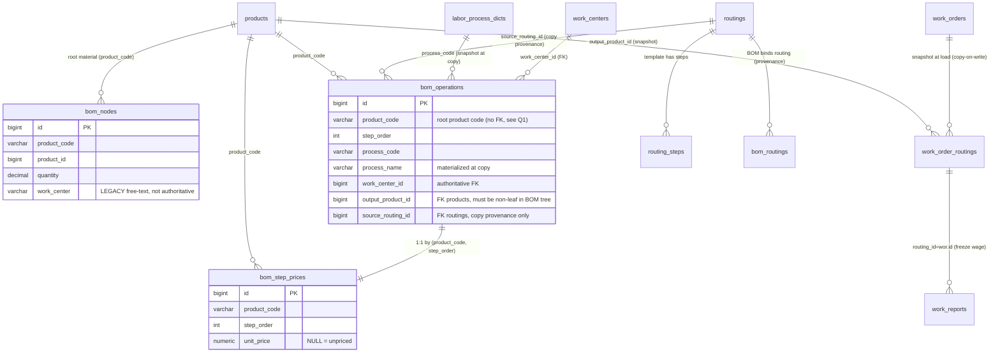

# BOM 内联工序+产出 + 价转工单 + routing 降级（重构设计）

> 状态：**设计待评审** · 推翻 clean break（commit `352944cb` + `29496edd`，即 `bom_routing_outputs` 覆盖层方案）
> 参考范式：ERPNext `BOM Operation` / Odoo `mrp.routing.workcenter` + `mrp.bom.operation`；计件制为中国制造业适配（三家教本无对应，价归 work_center 是工时制语义）
>
> 本文是 `docs/uml-design/` 的设计正文。前置阅读：`09-master-data.html`（被推翻段落见 §8）。原 `routing-decouple.md` / `routing-decouple.html` 整文件描述覆盖层方案，由 §8 退役清单收口（删除或重写）。
>
> 评审产出：phase 2 设计稿（用户决策）+ phase 3 四角色评审（ERP 架构师 / Rust 后端 / 制造业业务顾问 / ABT 前端），blocker / major 级 findings 已在相关章节吸收或于 §10 列为开放问题。

> **2026-07 落地补充（工序编辑独立页 + 工序字典默认值 + MES 放宽无产出工序）**：
> - **工序编辑独立页 `/admin/md/boms/{id}/operations`**：工序（`bom_operations`，per-product_code）从 BOM 编辑页迁到独立全屏页，采用方案 A 表格内联编辑 + SortableJS 拖拽排序。落点变更：§9 部署 A「BOM 编辑器（工序 CRUD + 上下移 + 拷贝）」→ 独立 `abt-web/src/pages/bom_operations.rs`；BOM 编辑页工序区改只读入口卡片（`管理工序 →` 跳转）。§8 退役清单 bom_detail 计件单价链接（review R-17 落点扑空）改指新页。
> - **工序字典加默认值字段**（migration `100`）：`labor_process_dict` 加 `default_work_center_id` / `default_standard_time`，选工序时自动带出默认工作中心/工时。（曾设计 `process_category` 做类别联动，后弃用——产出品可选 + 检验点/委外独立勾选已够，与三家 ERP 一致；migration `101` DROP 该列。）
> - **MES 放宽支持「无产出工序」（检测/检验不领料）**：参考三家 ERP（Odoo 最干净——无关联=空领料=自然跳过），放宽 ABT 原三处阻断：① 下达校验去「每道工序必须产出品」（保留计件单价校验）；② 工序级领料 `output=None → Ok(0)` 不生成领料单（`picking/implt.rs`）；③ 齐套 `output=None → 空 Available`（`work_order/implt.rs`）；④ 批次矩阵 UI `has_output` 判断，无产出工序不渲染领料按钮、直接收料/报工（`mes_work_center.rs render_batch_matrix_row`，学 OFBiz）。数据模型本就 Option 无需 schema 改；报工/开工/倒冲/IPQC/计件单价全 None-safe。
> - **路由变更**（`abt-web/src/routes/bom.rs`）：`BomOperationsPath` GET 从异步 card 片段 → `is_htmx` 分流独立整页；新增 `BomOperationReorderPath`（拖拽批量重排，调 `BomOperationService::replace_operations`）；退役 `BomOperationEditPath`（modal 编辑）/ `BomOperationMovePath`（上下移按钮，拖拽替代）。review R-25/R-26（bom_edit 5 浮层堆叠）前提失效。
> - **交互范式**：表格内联编辑——工序下拉 change → outerHTML 刷新整行（带默认值）；其余字段 change/blur → `hx-swap="none"` 静默保存（`hx-include="#op-row-{step}"` 收集整行）。复用 BOM 分类下拉 `change→hx-post` 范式（`bom_edit.rs:570-592`）的表格化扩展。

---

## 1. 背景与目标

### 1.1 推翻 clean break 的理由

刚合并的 routing 解耦（commit `352944cb`「工艺路线解耦 clean break 编译闭环」+ `29496edd`）采用的是**共享 routing 模板 + per-BOM 覆盖层**（`bom_routing_outputs`，migration 096）方案：

- `routing_steps` 保留为纯工艺模板（097 已 DROP 其 `product_id` / `unit_price`）
- `bom_routing_outputs` 作为 per-BOM 覆盖层，承载产出品 + 计件价 + 工作中心覆盖
- 工单 load 时 `routing_steps` × `bom_routing_outputs` 双源 JOIN

这个方案有三个结构性缺陷：

1. **routing 仍是「活绑定」**——编辑 `routing_steps` 仍可能影响已绑 BOM（故 096 配套加了 `update` 覆盖护栏 `routing/implt.rs:114-138` + `count_bom_outputs_by_routing`）。`step_order` 是模板与覆盖层的隐式关联键，模板删/重排会令覆盖行错位（把"焊接的产出/计件价"挂到"测试"工序）。护栏本身是症状，不是根治。
2. **产出品和工序分家**——"该 BOM 这道工序产出什么中间品"被强行拆到两张表（工序在 `routing_steps`、产出在 `bom_routing_outputs`），而它们本就是 per-BOM-per-step 同一行。这是覆盖层范式固有的脱节。
3. **UI 割裂**——`routing_detail` 必须维护一条覆盖层 drawer 链（`load_output_ctx` / `get_routing_output_edit` / `upsert_routing_output` / `delete_routing_output` + drawer/fragment/row :195-322, 658-813）才能编辑"自己的产出"，心智负担重。

### 1.2 新方向

把**工序 + 产出品**整体从共享模板转到 BOM 内联（ERPNext `BOM Operation` / Odoo `mrp.bom.operation` 范式）：

- 每个 BOM 拥有自己的工序行（`bom_operations`），per-BOM-per-step 自洽，承载全部工艺属性 + 产出品 + 工作中心
- **routing 降级为可选拷贝模板**——`apply_routing_to_bom` 一键把 `routing_steps` 全字段拷到 `bom_operations`，拷完即解耦（copy-on-write），此后改 `routing` 不回流影响已拷贝 BOM
- **`step_order` 错位风险自动消失**——覆盖层护栏（`routing/implt.rs:114-138` + `count_bom_outputs_by_routing`）失效，一并退役
- **`bom_routing_outputs` 拆分退役**——工艺属性 + 产出 + WC → `bom_operations`（合进自洽工序行）；`unit_price` → `bom_step_prices`；数据迁移完成后（migration 099）DROP 整表 + 整个 `bom_routing_output/` 模块

### 1.3 计件价转工单（per-BOM-per-step）

中国制造业计件制与三家 ERP 教本（ERPNext/Odoo/OFBiz 工时制，价归 `work_center.costs_hour`）根本不同：

- **同一台机器不同产品计件不同**——产品复杂度决定单价，价必须落 per-BOM-per-step 行，不能放 `work_center`
- **价的生命周期独立于工序**——价归 IE/成本域，工序归工艺域，owner 不同、写入路径不同（价由工单现场填后回写、工序由 BOM 编辑页维护），故**分表**（`bom_step_prices` 1:1 `bom_operations` 但独立写入）

工单创建时首次填价后保存（per-BOM-per-step），后续同 BOM 工单自动加载。报工 `wage_amount` 仍按冻结口径落到 `work_reports`（migration 062 语义不变）。

### 1.4 计件制保留（不改计时）

本次**不动**计件制本身——`material_consumption_mode`（Picking/Backflush）与计件/计时无关，`work_order_routings.unit_price` + `work_reports.wage_amount` 链路保留。重构只改"价的真相源从覆盖层移到 `bom_step_prices`"+"填价时机从 BOM 定义期推迟到工单下达期"。

---

## 2. 决策记录

| # | 决策 | 理由 | 状态 |
|---|---|---|---|
| D1 | 工序 + 产出转 BOM 内联（`bom_operations`） | ERPNext/Odoo 范式；根治 `step_order` 错位；UI 单端点 | 已定（用户拍板） |
| D2 | 计件价 per-BOM-per-step 分表（`bom_step_prices`） | 价归 IE/成本域、工序归工艺域，owner/生命周期不同；1:1 但 JOIN 成本可接受 | 已定 |
| D3 | routing 降级为纯拷贝模板（表保留、语义变更） | 不全盘删表（保 `routing_create` 模板编辑能力 + `routing_detail` 分发中心定位）；copy-on-write 天然解耦 | 已定 |
| D4 | 计件制保留，不改计时 | 本次范围外；`work_reports.wage_amount` 冻结语义（migration 062）不变 | 已定 |
| D5 | 关联键沿用 `product_code` | 与 `bom_routings` / `bom_routing_outputs` / `bom_labor_processes` 三表 + `ROOT_PRODUCT_CODE_SUBQUERY` 全对齐，迁移成本最低；`product_code` 有 partial unique index（`009:27` WHERE deleted_at IS NULL） | 已定（详见 §3.4 / §10-Q1） |
| D6 | **wage 口径统一到冻结值**（顺手修 latent bug） | phase 3 两名评审均标 major：`list_all_wage_summaries:185` 重算 vs `get_wage_summary:112` 冻结，priceWriteBack 放大该不一致 → 发薪页打架。**纳入本次范围**（非 openQuestion） | **由 review 升级为必做**（§5.4 / §8 / §9） |
| D7 | **工单填价 UI 落点 = release drawer**（非工单 create/edit 页） | phase 3 前端 blocker：工单详情页已下线（`routes/mes_order.rs:11-13`），唯一已对 `unit_price` 缺失做硬校验的 UI 是 `mes_work_center.rs` release drawer。`set_work_order_step_price` 的内联编辑器无处落，除非重开工单详情页 | **由 review 升级为必做**（§5.3 / §9） |
| D8 | **copy-on-write 锁定策略 = per-order lock** | phase 3 业务+后端 major：原设计内部矛盾（loadFlow step5 per-step 重载 vs openQ#4 整单锁定）。任一 step 报工即整单工序结构冻结，避免半 reload 导致 step_order 错位 + 快照手工调整丢失 | **由 review 升级为必做**（§5.2 / §10-Q4） |
| D9 | **`work_orders.routing_id` 停写但保留作溯源** | phase 3 后端 major：load 不依赖它（改读 `bom_operations`），但 `has_routing` 事件 payload（`:274`）+ `routing_doc` 展示（`:571-579`）+ release 兜底（`:196`）仍读它。方案：`try_load_operations_from_bom` 仍写 `routing_id`（值取自 `bom_routings` 绑定 / `bom_operations.source_routing_id`），零下游改动 | **由 review 升级为必做**（§4.3 / §5.1） |
| D10 | `is_required` 暂不下沉 `work_order_routings` 快照 | routing_steps 现状也从未下沉（`003:90-108` 无此列）；本期接受该缺口，未来需要再 ALTER | 已定（§5.5 缺口记录） |
| D11 | **用户评审拍板**（B1/B2/Q1/Q3/Q5/Q6/Q7 全采纳推荐） | B1=release drawer 填价（D7 确认）｜B2=per-order lock（D8 确认）｜Q1=沿用 `product_code` + 产品改名守卫（技术债，§10.4）｜**Q3=NULL 价报工 re-check 纳入本次**（§5.5 升级为必做）｜**Q5=`bom_labor_processes` 本期迁入 `bom_step_prices`**（Excel 导入改写，消除 split-brain；§7.4 从"双轨白名单"升级为强制迁移 + §9 步骤 2/4 补迁移子任务）｜Q6=`bom_routings` 保留作绑定记录｜Q7=控制缺口记文档 + 月度审计报告（不做 draft→active 状态机） | **已拍板（评审会）** |

---

## 3. 新数据模型

### 3.1 `bom_operations`（新建 — BOM 内联工序）

**用途**：per-BOM-per-step 自洽工序行，承载全部工艺属性 + 产出品 + 工作中心。BOM 拥有自己的工序，编辑 routing 模板碰不到这里（copy-on-write）。**推翻并取代 `bom_routing_outputs` 覆盖层**。

```sql
-- migration 098 M1
CREATE TABLE IF NOT EXISTS bom_operations (
    id                  BIGSERIAL     PRIMARY KEY,
    product_code        VARCHAR(100)  NOT NULL,                  -- 成品编码（= BOM 根节点 product_code；与 bom_routings/bom_labor_processes/ROOT_PRODUCT_CODE_SUBQUERY 对齐）
    step_order          INT           NOT NULL,                  -- BOM 内工序序号（BOM 自主，不再对齐 routing_steps）
    process_code        VARCHAR(100)  NOT NULL,                  -- 工序编码（→ labor_process_dicts.code）
    process_name        VARCHAR(200)  NOT NULL,                  -- 工序名（拷贝时 COALESCE(lpd.name, process_code) 物化落库；copy-on-write 后字典改名不自动同步——见 §4.4 resync 工具）
    work_center_id      BIGINT,                                  -- 内联工作中心（非"覆盖"语义；空=未指定）
    standard_time       DECIMAL(18,6),                           -- 标准工时(分钟)
    standard_cost       DECIMAL(18,6),                           -- 标准成本(每小时，与 work_centers.costs_hour 并存)
    allowed_loss_rate   DECIMAL(18,6) NOT NULL DEFAULT 0,
    is_outsourced       BOOLEAN       NOT NULL DEFAULT false,
    is_inspection_point BOOLEAN       NOT NULL DEFAULT false,    -- 免检不免工序
    is_required         BOOLEAN       NOT NULL DEFAULT true,
    output_product_id   BIGINT        REFERENCES products(product_id), -- 该工序产出的中间品（须 ∈ 该 BOM 非叶子节点，handler 层校验——见 §3.5）
    remark              TEXT,
    source_routing_id   BIGINT        REFERENCES routings(id),   -- ★ 拷贝来源 routing（纯溯源；改 routing 不回流影响本行）；手工建的工序为 NULL
    operator_id         BIGINT,
    created_at          TIMESTAMPTZ   NOT NULL DEFAULT now(),
    updated_at          TIMESTAMPTZ,
    UNIQUE (product_code, step_order)                             -- 一个 BOM 一道工序一行
);
CREATE INDEX IF NOT EXISTS idx_bom_operations_product    ON bom_operations(product_code);
CREATE INDEX IF NOT EXISTS idx_bom_operations_output     ON bom_operations(output_product_id) WHERE output_product_id IS NOT NULL;
CREATE INDEX IF NOT EXISTS idx_bom_operations_source_rt  ON bom_operations(source_routing_id) WHERE source_routing_id IS NOT NULL;  -- routing_detail "关联 BOM" 反查（review minor）
COMMENT ON TABLE bom_operations IS 'BOM 内联工序：per-BOM-per-step 自洽工序行（工艺+产出+WC），copy-on-write 与 routing 模板解耦';
```

**字段说明要点**：

- `product_code`：关联键沿用 `product_code`（与三张存量表 + `ROOT_PRODUCT_CODE_SUBQUERY` 对齐，迁移成本最低）。**注意措辞校准**：`bom_operations` 命名"per-BOM-per-step"实际是 **per-root-product-code-per-step**——同一成品的多个 BOM 版本共享一组工序行（这是继承自 `bom_routing_outputs` 的既有语义，非本次回归）。`product_code` 有 partial unique index（`009:27` WHERE deleted_at IS NULL），重复风险低；真实风险是"改名断链"（见 §10-Q1）。
- `source_routing_id`：拷贝来源纯溯源，与 `bom_routings.routing_id` 冗余但**语义不同**（`source_routing_id` 是"工序行最初从哪个模板拷"，`bom_routings.routing_id` 是"BOM 当前的绑定记录"），两者会分叉（见 §6.3）。
- `process_name` **物化落库**：copy-on-write 隔离的预期行为；补 `resync_process_names()` 运维接口供字典标准化后手工触发（§4.4）。
- **无 `deleted_at`**：与 `bom_routing_outputs` 前身一致；`bom_operations` 是 BOM 从属行、随 BOM 保存整体 `replace_operations` 替换（硬删语义），生命周期不同于独立实体，软删无意义。

### 3.2 `bom_step_prices`（新建 — per-BOM-per-step 计件单价）

**用途**：中国制造业计件单价表（三家 ERP 无对应——它们是工时制，价归 `work_center`）。同一台机不同产品计件不同，故单价结构上必须落 per-BOM-per-step 行。与 `bom_operations` 分表：价归 IE/成本，工序归工艺。工单创建时首次填后保存，后续同 BOM 工单自动加载。

```sql
-- migration 098 M1
CREATE TABLE IF NOT EXISTS bom_step_prices (
    id            BIGSERIAL     PRIMARY KEY,
    product_code  VARCHAR(100)  NOT NULL,
    step_order    INT           NOT NULL,
    unit_price    NUMERIC(18,6),                          -- 该 BOM 该工序计件单价（空 = 未定价，待工单现场填后回写）
    operator_id   BIGINT,
    created_at    TIMESTAMPTZ   NOT NULL DEFAULT now(),
    updated_at    TIMESTAMPTZ,
    UNIQUE (product_code, step_order)
);
CREATE INDEX IF NOT EXISTS idx_bom_step_prices_product ON bom_step_prices(product_code);
COMMENT ON TABLE bom_step_prices IS 'per-BOM-per-step 计件单价：工单下达时首次填后保存，后续同 BOM 工单自动加载。报工 wage_amount 仍冻结到 work_reports（migration 062 语义不变）';
```

**约束**（应用层校验，不用 DB 触发器）：`bom_step_prices.upsert_price` 前验 `bom_operations` 有对应 `(product_code, step_order)` 行，避免"有价无工序"孤儿单价行（review minor）。

### 3.3 `bom_operations` vs `bom_nodes`（正交不冗余，显式声明边界）

这是用户核心疑问。结论：二者正交——

| 表 | 语义 | 对应 ERPNext | 对应 Odoo |
|---|---|---|---|
| `bom_nodes`（010） | **物料树**（parent_id / product_id / quantity）——WHAT goes in | `BOM Item` | `bom_line_ids` |
| `bom_operations`（新） | **工艺序列**（step_order / process_code / work_center_id）——HOW to make | `BOM Operation` | `operation_ids` |

这正是 ERPNext / Odoo 的双轴结构，无冗余。

**遗留字段边界**（review minor）：`bom_nodes.work_center VARCHAR(100)`（`repo.rs:389/401`，非 FK）与 `bom_operations.work_center_id`（FK）语义重叠。本期**不强行删** `bom_nodes.work_center`（避免动 BOM 物料结构），但在 `bom_operations` 文档/COMMENT 里写清它是工艺权威：

> `bom_operations.work_center_id`（BIGINT FK）是**权威工作中心**；`bom_nodes.work_center`（VARCHAR free-text）是遗留字段，仅为旧 BOM 数据兼容，待长期清理。

BOM 编辑 UI 引导工作中心落 `bom_operations`，`bom_nodes.work_center` 不再写入。

### 3.4 现有表改动

#### `bom_routing_outputs`（推翻 / 拆分 / 最终 DROP）

- migration 098 **不改本表结构**，仅 `INSERT...SELECT` 从它回填到 `bom_operations` / `bom_step_prices`（M2(a) / M2(b)）
- migration 099（代码切源后、grep 确认全仓无读者后）`DROP TABLE IF EXISTS bom_routing_outputs;`
- **保留** 096 M2(b) 的 `work_order_routings.product_id` 历史快照修复（`096:40-47`）——这是独立 bug 修复，无论方向如何都保留，不受本表废弃影响

#### `routings` / `routing_steps`（降级为纯模板库，097 不回滚）

- 保留为**纯工艺模板库**（可跨产品复用）
- `routing_steps` 已是 097 clean break 后的纯工艺结构（`product_id` / `unit_price` 已 DROP，只剩 `process_code` / `step_order` / `work_center_id` / `standard_time` / `standard_cost` / `allowed_loss_rate` / `is_outsourced` / `is_inspection_point` / `is_required` / `remark`）——这正是新方向"routing=纯模板"要的状态，**097 不回滚**
- **移除 `routing update` 覆盖护栏**（`routing/implt.rs:114-138` + `count_bom_outputs_by_routing:106-115`）：copy-on-write 后改 `routing_steps` 不影响已拷贝的 `bom_operations` 行，`step_order` 错位风险消失，护栏失效，`delete_steps + insert_steps` 全重建可自由进行
- `routing delete` 的 `bom_routings` 绑定守卫（`:169-174`）可保留（无害）或放宽为 warn

#### `bom_routings`（角色降级）

- 表保留，但 `routing_id` 语义从"活绑定驱动 load"降级为"该 BOM 当前绑定记录"的**溯源**
- `set_bom_routing` / `get_bom_routing`（`routing/implt.rs:228-287`）仍可记录绑定，维持现有绑定 UI 不破
- **不再驱动工单 load**——load 改读 `bom_operations`
- 与 `bom_operations.source_routing_id` 的关系见 §6.3

#### `bom_labor_processes`（legacy 计件表，本期保留双轨，非迁移目标）

- `try_build_labor_from_routing` 无 `bom_operations` 时回退 `build_labor_from_legacy`（`bom/implt.rs:835-855`）——本期保留双轨：有 `bom_operations` 走新路径、无则回退 `bom_labor_processes`
- **不迁移、不动 Excel 导入路径**（`shared/excel/labor_process_import.rs` / `labor_process_export.rs`，6994 行 / 534 产品）
- **双轨期 split-brain 风险**见 §7.4 迁移尽职调查 + §10-Q5

#### `work_order_routings`（表结构不变）

下游消费方（报工 `confirm_routing_step` / 领料 `create_for_routing_step` / 齐套 `compute_step_availability` / 委外 `outsourcing_summary` / 工资汇总）全部读 `work_order_routings` 快照，**不直接读 `bom_operations` / `bom_step_prices`**。只要 load 写入逻辑改对（字段映射一致），下游零改动。

### 3.5 实体关系（Mermaid）



---

## 4. Service trait（接口签名）

### 4.1 `BomOperationService`（新模块 `abt-core/src/master_data/bom_operation/`）

模块文件：`service.rs` / `repo.rs` / `model.rs` / `implt.rs` / `mod.rs`（抄 `bom_routing_output` 模块结构）。

**实现约定（review nit）**：repo 层全用 `sqlx::query_as::<Postgres, T>(r#"..."#)` 运行时字符串（不经 `query!` 宏），与 `bom_routing_output` 前身一致——这样 migration 与 `cargo clippy` 解耦，可先写代码 clippy 闭环、再跑 migration 098 建表（运行时才需表存在）。本项目无 migration runner（见 memory `reference-abt-migration-manual`）。

```rust
#[async_trait]
pub trait BomOperationService: Send + Sync {
    /// 列出某 BOM 全部工序行（按 step_order）
    async fn list_operations(
        &self, ctx: &ServiceContext, db: PgExecutor<'_>, product_code: String,
    ) -> Result<Vec<BomOperation>>;

    /// 单行查找（BOM 成本取数 / 工单 load 预检用）
    async fn find_operation(
        &self, ctx: &ServiceContext, db: PgExecutor<'_>,
        product_code: String, step_order: i32,
    ) -> Result<Option<BomOperation>>;

    /// 逐行 upsert（by product_code+step_order），复用 BomRoutingOutputRepo.upsert 的 ON CONFLICT 模式。
    /// 产出品 output_product_id 须 ∈ 该 BOM 非叶子节点（list_non_leaf_product_ids_by_product_codes 校验，搬自 retired overlay）。
    async fn upsert_operation(
        &self, ctx: &ServiceContext, db: PgExecutor<'_>, req: UpsertBomOperationReq,
    ) -> Result<()>;

    /// 删一行
    async fn delete_operation(
        &self, ctx: &ServiceContext, db: PgExecutor<'_>,
        product_code: String, step_order: i32,
    ) -> Result<()>;

    /// 整批替换（delete all + insert），BOM 保存 handler 用。
    /// ★ 事务边界约定（review minor）：必须在外层事务内调用（传入 &mut *tx），
    ///   本方法内部不 begin/commit。参考 load_routings_from_template 注释模式（production_batch/implt.rs:587-588）。
    async fn replace_operations(
        &self, ctx: &ServiceContext, db: PgExecutor<'_>,
        product_code: String, ops: Vec<UpsertBomOperationReq>,
    ) -> Result<()>;

    /// ★ ERPNext get_routing 拷贝守卫（bom.py:488-501 + set_routing_operations :914-916 "if not operations"）：
    ///   仅当该 BOM bom_operations 无行时从 routing_steps 全字段拷贝；已有行则 Err（避免覆盖手工编辑）。
    ///   force=true 时 delete all + 重拷（review minor：给"试错后想重来"留出口，需 confirm 二次确认）。
    async fn apply_routing_to_bom(
        &self, ctx: &ServiceContext, db: PgExecutor<'_>,
        product_code: String, routing_id: i64, force: bool,
    ) -> Result<usize>;

    /// 运维：批量同步工序名（按 process_code JOIN labor_process_dicts 批量 UPDATE process_name）。
    /// 字典标准化后由 IE 手工触发，不做自动同步（保 copy-on-write 隔离）。
    async fn resync_process_names(&self, ctx: &ServiceContext, db: PgExecutor<'_>) -> Result<usize>;
}
```

工厂：`pub fn new_bom_operation_service(pool: PgPool) -> Arc<dyn BomOperationService>`（按需工厂模式，struct 只持 `PgPool`，共享服务通过工厂函数获取）。

### 4.2 `BomStepPriceService`（新模块 `abt-core/src/master_data/bom_step_price/`）

```rust
#[async_trait]
pub trait BomStepPriceService: Send + Sync {
    /// 工单 load / BOM 成本报告取数用
    async fn find_prices_by_product(
        &self, ctx: &ServiceContext, db: PgExecutor<'_>, product_code: String,
    ) -> Result<Vec<BomStepPrice>>;

    async fn find_price(
        &self, ctx: &ServiceContext, db: PgExecutor<'_>,
        product_code: String, step_order: i32,
    ) -> Result<Option<Decimal>>;

    /// ★ 工单填价回写 + BOM 页直接定价共用入口（by product_code+step_order）。
    ///   upsert 前校验 bom_operations 有对应行，拒"有价无工序"孤儿（review minor）。
    async fn upsert_price(
        &self, ctx: &ServiceContext, db: PgExecutor<'_>,
        product_code: String, step_order: i32, unit_price: Decimal,
    ) -> Result<()>;
}
```

### 4.3 改造后的工单 load 接口（替换 `load_routings_from_template` / `try_load_routings_from_bom`）

```rust
// ProductionBatchService 新方法（替换 production_batch/implt.rs:579-652 的 load_routings_from_template）
async fn load_operations_from_bom(
    &self, ctx: &ServiceContext, db: PgExecutor<'_>,
    work_order_id: i64, product_code: String,
) -> Result<usize>;  // 无 routing_id 参数；读 bom_operations + LEFT JOIN bom_step_prices；见 §5.1

// WorkOrderService 新方法（替换 work_order/implt.rs:51-75 的 try_load_routings_from_bom）
async fn try_load_operations_from_bom(
    &self, ctx: &ServiceContext, db: PgExecutor<'_>,
    work_order_id: i64, product_id: i64,
) -> Result<()>;  // product→product_code；ops=bom_operation_svc.list_operations；非空则 load；
                  //   ★ 仍写 work_orders.routing_id 作纯溯源（值取 bom_routings 绑定 / source_routing_id），零下游改动（review major D9）
```

### 4.4 工单填价回写接口（`WorkOrderService` 新增）

```rust
// set_work_order_step_price：单事务两步原子
//   (a) bom_step_price_svc.upsert_price(product_code, step_no, unit_price) → 写真相源
//   (b) UPDATE work_order_routings SET unit_price WHERE work_order_id+step_no → 刷新本工单快照
//   守卫：has_report(wo, step_no) → 拒（wage 已冻结）
async fn set_work_order_step_price(
    &self, ctx: &ServiceContext, db: PgExecutor<'_>,
    work_order_id: i64, step_no: i32, unit_price: Decimal,
) -> Result<()>;
```

**实现注意（review major — `has_report` 签名）**：`WorkOrderRoutingRepo::has_report(executor, routing_id: i64)` 的参数是 `work_order_routings.id`（`wor.id`），**不是** `(wo_id, step_no)`（`work_reports.routing_id` 存的是 `wor.id`）。实现需**两步**：

1. `WorkOrderRoutingRepo::get_by_work_order_and_step(wo_id, step_no)` 取出 `wor.id`（拿不到 → `not_found`）
2. `has_report(wor.id)` → `true` 则拒（`DomainError::business_rule("该工序已报工，wage 已冻结，不可改价")`）

顺带：`update work_order_routings SET unit_price` 的 WHERE 用 `work_order_id + step_no` 即可（有 UNIQUE 约束），不必经 `wor.id`。

---

## 5. 工单 load + 填价回写流程

### 5.1 load 流程（`try_load_operations_from_bom` → `load_operations_from_bom`）

工单 `create()` → `try_load_operations_from_bom(wo_id, product_id)`（替换 `work_order/implt.rs:51-75`）：

1. `product = product_svc.get(product_id)` → `product_code`
2. `ops = bom_operation_svc.list_operations(product_code)` // `bom_operations` 全量（自洽工序行）
3. **若 `ops` 为空 → 跳过**（留空，由 BOM 编辑页引导先配工序或从 routing 拷贝）；★ 不再回退查 `bom_routings`（routing 降级为拷贝源，不驱动 load）
4. `prices = bom_step_price_svc.find_prices_by_product(product_code)` → `price_map: HashMap<step_order, Decimal>`
5. **per-order lock（review major D8）**：`WorkOrderRoutingRepo::has_any_report(wo_id)` → 若**已任一 step 报工**，**整单工序结构冻结**，跳过 reload（不再删未报工 step 重插）；仅 `Draft/Released` 且**全无报工**的工单才允许 reload
6. 遍历 `ops`：`INSERT work_order_routings`（`work_order_id` / `step_no=op.step_order` / `process_name` / `work_center_id` / `standard_time` / `standard_cost` / `allowed_loss_rate` / `is_outsourced` / `is_inspection_point` / `product_id=op.output_product_id` / `unit_price=price_map.get(op.step_order)` / `planned_qty=wo.planned_qty`）—— 数据全部来自 `bom_operations` 一站取齐，价来自 `bom_step_prices`（未定价则 NULL）
7. ★ **仍写 `work_orders.routing_id` 作纯溯源**（review major D9）：值取 `bom_routings` 绑定的 `routing_id`（若无则取 `bom_operations` 第一行的 `source_routing_id`，再无则 None）。load 不依赖它，但 `has_routing` 事件（`:274`）+ `routing_doc` 展示（`:571-579`）+ release 兜底（`:196`）仍读它，零下游改动
8. 审计日志（复用 `:642-649`）

**release() 兜底**（`work_order/implt.rs:196-199`）：改造前无工序老工单（`work_order_routings` 为空）→ 同样调 `try_load_operations_from_bom`。判断条件从"`routing_id.is_none()`"改为"**工序快照为空**"（review nit：这其实是 bug 修复——edge case `routing_id=Some` 但 `work_order_routings` 空的老工单，旧逻辑跳过补加载，新逻辑会触发 load；迁移期 release 回归测试加这条用例）。

### 5.2 copy-on-write 锁定策略（per-order lock，D8）

**原设计内部矛盾**（phase 3 业务+后端 major）：

- loadFlow step5 原写"复用 `load_routings_from_template:603-615` 的 `locked_step_nos`——删未报工工序、锁已报工 step_no"即 **per-step 重载**
- openQuestion#4 又建议"任一 step 报工即整单工序结构冻结"

per-step 重载的风险：WO 报工了 step1，用户改 BOM 的 step2/step3，重载会丢弃 step2/step3 快照里手工设的工作中心覆盖、以及尚未经 priceWriteBack 回写到 `bom_step_prices` 的单价（priceWriteBack 只在填价动作触发，若用户在工单快照上改了价但没走该入口，重载即丢）。这是计件工资资产丢失的具体路径。

**本次拍板（D8）：per-order lock**——任一 step 报工即整单工序结构冻结，不再重载（结构漂移归零，快照手工调整得以保留）。`Draft/Released` 且全无报工的工单才允许重载。

> 工序快照与物料快照的**不对称**（review minor，显式记录为取舍非缺陷）：物料走 `bom_snapshots`（JSONB 版本快照，release 时冻结 `bom_snapshot_id`，整版冻结）；工序走 `work_order_routings`（运行时 copy-on-write 快照）。per-order lock 下，工单一旦有报工，工序结构也等价于"整版冻结"，两条机制在"有报工即锁定"语义上对齐。

### 5.3 填价回写流程（`set_work_order_step_price`）

**UI 落点（D7，review 前端 blocker）**：**release drawer**（`mes_work_center.rs`），非工单 create/edit 页。工单详情页已下线（`routes/mes_order.rs:11-13` 注释），`mes_order_create.rs` 不显示工序（工序在 create 后 `try_load` 才生成），不宜在那里填价。release drawer 是唯一已对 `unit_price` 缺失做硬校验的 UI（`ReleaseDrawerData:1795` / `render_release_routing_row:2227` / `release_order:2292` `price_missing` 校验）。

**交互闭环**：

```
① release drawer 渲染：render_release_routing_row 的单价 cell 在「未报工 + 价缺失/为零」时
   始终渲染为 <input type=number> + 行内 form（无论首次渲染还是 errors 重渲染）；已报工则只读文本（has_report 守卫）
② 用户填价 → blur 触发 hx-post WoStepPricePath → set_work_order_step_price(wo_id, step_no, unit_price)
   → 行自替换（hx-target="closest tr" hx-swap="outerHTML"）显示已填价
③ 用户点下达 → release_order 校验 price_missing（兜底，用户没填就点下达时给红框提示）
```

**事务边界**：单事务（`state.pool.begin()`）内两步原子，任一失败回滚：

- (a) `bom_step_price_svc.upsert_price(product_code, step_no, unit_price)` → 写 `bom_step_prices`（per-BOM-per-step 真相源，后续同 BOM 工单自动加载）。`product_code` 由 `wo.product_id → product.product_code` 解析
- (b) `UPDATE work_order_routings SET unit_price=$, updated_at=now() WHERE work_order_id=$ AND step_no=$` → 刷新本工单快照（copy-on-write 执行价）

**copy-on-write 边界守卫**：执行 (b) 前两步解析 `wor.id` + `has_report(wor.id)`（见 §4.4 签名）——该 `(wo, step_no)` 若已有 `work_report`（`wage_amount` 已按旧价冻结到 `work_reports`，migration 062:3,9-13 起）→ 拒绝改价，返回 `DomainError::business_rule`。未报工 → 允许改。

**真相源 vs 快照的关系**：

- `bom_step_prices` 是"**未来工单的加载源**"（per-BOM-per-step，跨工单共享）
- `work_order_routings.unit_price` 是"**本工单的冻结执行价**"（per-work-order）
- **首次填价**：两者同步写
- **后续同 BOM 新工单**：load 时自动从 `bom_step_prices` 读（无需再填）
- **改价**：只影响未来工单 + 当前未报工快照，**不追溯**已冻结的 `work_reports.wage_amount`（报工冻结语义保留）

### 5.4 wage 口径统一（D6，顺手修 latent bug）

**现存 bug**（phase 3 两名评审均标 major）：

- `get_wage_summary`（`work_report/implt.rs:112`）用冻结的 `report.wage_amount`
- `list_all_wage_summaries`（`:185`）却用**当前** `work_order_routings.unit_price` 重算 `(completed_qty + non_operator_defect_qty) * unit_price`

改单价后两套口径打架。本次 priceWriteBack 会更频繁地变更 `work_order_routings.unit_price`（per-step），放大两套口径的可观察差异——发薪页（单人 detail）和工资汇总页（全员 list）对同一个工人同一周期显示不同金额。这是计件工资系统的红线。

**本次强制统一**（纳入范围，非 openQuestion）：

- `list_all_wage_summaries` 直接用 `report.wage_amount`，删除 `:177-185` 的重算分支（`process_name` / `unit_price` 仍可从 `routing_map` 取用于展示，但 `wage_amount` 以冻结值为准）
- priceWriteBack 的 `has_report` 守卫保证已报工 step 价不变，冻结值与重算值一致；统一后消除 latent bug
- 补一条单测：改价后两个接口返回相同 `total_amount`

报工冻结公式**不变**：`confirm_routing_step:229` `wage_amount = (completed_qty + non_operator_defect_qty) * work_order_routings.unit_price`（`production_batch/implt.rs:224-229`）。

### 5.5 已知缺口（显式记录）

- **`is_required` 不下沉快照**（review minor D10）：`bom_operations` 有 `is_required` 列，但 `work_order_routings` 表无此列（`003:90-108` 确认）。`load_operations_from_bom` 的 INSERT 清单未含 `is_required`，该属性不下沉到工单快照。下游（`confirm_routing_step` 等）当前不读快照的 `is_required`，故无功能性 break。本期接受（与现状一致：`routing_steps.is_required` 也从未下沉到 `work_order_routings`）。若未来工单层需要"免检不免工序/必经工序"语义，再走 `ALTER work_order_routings ADD is_required + 回填`。
- **`unit_price` NULL → 0 工资的静默失败**（review major，业务顾问）：`confirm_routing_step:224` `unit_price.unwrap_or(Decimal::ZERO)` —— 工序未定价就直接报工，`wage_amount` 冻结为 0。新设计把定价时机从 BOM 定义期推迟到工单下达期，NULL 价格到达报工环节的概率结构性上升。**缓解**：release drawer 已有 `price_missing` 校验兜底；建议本次顺手在 `confirm_routing_step` 进入前 re-check 该 step 的 `unit_price` 非空，空则 `DomainError::business_rule` 拒绝报工并提示"先定价"（见 §10-Q3，需用户确认是否纳入本次范围）。

---

## 6. routing 降级方案

### 6.1 语义变更（不全盘删表）

| 对象 | 改造前（clean break） | 改造后（本设计） |
|---|---|---|
| `routings` + `routing_steps` | 纯工艺模板（097 已是） | **纯工艺模板库**（可跨产品复用），097 不回滚 |
| `routing update` 覆盖护栏 | `:114-138` + `count_bom_outputs_by_routing` 防 step 删/重排错位 | **移除**（copy-on-write 后改 routing 不影响已拷贝 bom_operations，护栏失效） |
| `routing delete` 的 `bom_routings` 绑定守卫 | `:169-174` | 保留（无害）或放宽为 warn |
| `bom_routings.routing_id` | "活绑定"驱动 load | **降级为"绑定记录"纯溯源**（不驱动 load） |
| 工单 load 数据源 | `routing_steps` × `bom_routing_outputs` 双源 JOIN | `bom_operations` 单源（`bom_step_prices` LEFT JOIN） |

### 6.2 拷贝入口（抄 ERPNext `get_routing` `bom.py:488-501` + `set_routing_operations :914-916` "if not operations"）

**`BomOperationService::apply_routing_to_bom(product_code, routing_id, force: bool)`**：

- `force=false`（默认）：仅当该 BOM `bom_operations` **无行**时，从 `routing_steps` 全字段拷贝（`process_code` / `step_order` / `process_name`[COALESCE `lpd.name`] / `work_center_id` / `standard_time` / `standard_cost` / `allowed_loss_rate` / `is_outsourced` / `is_inspection_point` / `is_required` / `remark`）+ 设 `source_routing_id=routing_id`；已有工序行则 `Err`（避免覆盖手工编辑）
- `force=true`（review minor 出口）：`delete all bom_operations` + 从 `routing_steps` 重拷，`source_routing_id` 重置。需 confirm 二次确认 + 审计日志。给"试错后想重来"留出口
- **拷贝不搬 `unit_price`**（模板无价，097 已 DROP）、**不搬 `output_product_id`**（模板无产出，097 已 DROP）——这两项拷贝后在 `bom_operations`（产出）/ release drawer 填价（单价）单独维护

**UI**：routing 详情页保留"拷贝工序到 BOM"按钮（给已绑定 BOM 一键 `apply_routing_to_bom`）。按钮文案明确（review minor）：

> "拷贝后将与此 BOM 独立，后续修改模板不影响本 BOM；如需重新同步，需先清空现有工序（force 重拷）"

### 6.3 "routing 关联 BOM"的两个真相源（review minor）

routing 降级后，`bom_routings`（绑定记录）与 `bom_operations.source_routing_id`（拷贝来源）都能回答"哪些 BOM 用了这个 routing"，但二者会分叉：

- BOM 拷贝后手工改工序 → `bom_routings` 仍绑定、`source_routing_id` 仍指向模板，但实际工序已偏离模板

**建议**：`routing_detail`"关联 BOM"列表改用 `bom_operations.source_routing_id`（更准，反映真实拷贝关系），`bom_routings` 降为"最初绑定记录"纯溯源。短期可保留 `bom_routings` 不破 UI，但注释清楚语义已弱化。可选：UI 上标注"绑定但工序已编辑"状态（比对 `source_routing_id` 对应模板步骤数 vs `bom_operations` 步骤数）。

### 6.4 UI 迁移

#### routing_detail 覆盖层 drawer 整条链退役

`abt-web/src/pages/routing_detail.rs` 覆盖层编辑 drawer 链整条退役（编辑入口迁 BOM 页）：

- handlers：`load_output_ctx:198-226` + `get_routing_output_edit:230-242` + `upsert_routing_output:246-297` + `delete_routing_output:301-322`
- components：`output_edit_drawer:658-680` + `output_edit_fragment:683-712` + `output_step_row:716-813`
- types：`OutputEditParams` / `OutputUpsertForm` / `OutputDeleteForm:54-78`
- routes：`routes/routing.rs` 的 `RoutingOutputEditPath:71-75` + `RoutingOutputUpsertPath:78-82` + `RoutingOutputDeletePath:85-89` + 3 个 `route` 注册 `:120-131`
- 入口：「维护产出」按钮 `:590`（关联 BOM 行，整条 drawer 链起点）—— **替代动作**：每行渲染"拷贝工序到此 BOM"按钮（`hx-post RoutingApplyToBomPath`，成功跳转 `BomEditPath`，失败按 §5.6 form 校验失败规范返回重渲染列表片段 + 行内 alert，禁 toast）

routing 详情页保留为"模板分发中心"（拷贝入口），符合降级定位。`product_picker` import（`:24`）**保留**（`bind_bom:532` `bom_picker_modal` 仍用），勿误删。

#### routing_create 警告条删除

`routing_create.rs:548-557` 警告条「删除或重排已有工序将被拒绝」删除（护栏已移除）。`routing_create` 工序表的产出/价两列 096/097 周边已移除，保持。

---

## 7. 数据迁移

### 7.1 migration 098 `migrate_bom_inline_operations.sql`（幂等，BEGIN...COMMIT 包裹）

**M1 建表**：`CREATE TABLE IF NOT EXISTS bom_operations (...)` 与 `bom_step_prices (...)`，含 `UNIQUE(product_code, step_order)` + 索引 + `COMMENT`（DDL 见 §3.1 / §3.2）。

**M2(a) 回填 `bom_operations`**——工艺属性从模板、产出/WC 从覆盖层（COALESCE 覆盖优先回退模板→落为内联值）：

```sql
INSERT INTO bom_operations (
    product_code, step_order, process_code, process_name,
    work_center_id, standard_time, standard_cost, allowed_loss_rate,
    is_outsourced, is_inspection_point, is_required,
    output_product_id, source_routing_id, remark, created_at
)
SELECT
    br.product_code, rs.step_order, rs.process_code,
    COALESCE(lpd.name, rs.process_code),
    COALESCE(bro.work_center_id, rs.work_center_id),    -- 覆盖层优先，回退模板
    rs.standard_time, rs.standard_cost, rs.allowed_loss_rate,
    rs.is_outsourced, rs.is_inspection_point, rs.is_required,
    bro.output_product_id,                               -- 产出仅来自覆盖层（模板 097 已 DROP）
    br.routing_id,                                       -- source_routing_id = 拷贝来源
    rs.remark, now()
FROM bom_routings br
JOIN routing_steps rs ON rs.routing_id = br.routing_id
LEFT JOIN labor_process_dicts lpd ON lpd.code = rs.process_code AND lpd.deleted_at IS NULL
LEFT JOIN bom_routing_outputs bro ON bro.product_code = br.product_code AND bro.step_order = rs.step_order
ON CONFLICT (product_code, step_order) DO NOTHING;
-- 注意：INSERT...SELECT 的 JOIN ON 可引用任意表（无 UPDATE...FROM 目标表坑，对比 096:38-39 注释）
```

**M2(b) ★ 回填 `bom_step_prices`**（保全商务录入计件价资产，约 3120 行）：

```sql
INSERT INTO bom_step_prices (product_code, step_order, unit_price, operator_id, created_at)
SELECT bro.product_code, bro.step_order, bro.unit_price, bro.operator_id, now()
FROM bom_routing_outputs bro
WHERE bro.unit_price IS NOT NULL
ON CONFLICT (product_code, step_order) DO NOTHING;
```

**M3 校验（升级为部署门禁，review major D-reporting）**——原设计标"可选 SELECT COUNT"，phase 3 后端 major 升级为**强制阻断代码切换**的门禁：

```sql
-- 校验 1：bom_operations 行数应 = 绑定 BOM × routing_steps 行数（RT000001 家族 388×8 量级）
SELECT
    (SELECT COUNT(*) FROM bom_routings br JOIN routing_steps rs ON rs.routing_id = br.routing_id) AS expected_ops,
    (SELECT COUNT(*) FROM bom_operations) AS actual_ops;
-- expected_ops 与 actual_ops 应相等；不等则人工排查后重跑 M2(a)

-- 校验 2：bom_step_prices 行数 = bom_routing_outputs 中 unit_price IS NOT NULL 行数
SELECT
    (SELECT COUNT(*) FROM bom_routing_outputs WHERE unit_price IS NOT NULL) AS expected_prices,
    (SELECT COUNT(*) FROM bom_step_prices) AS actual_prices;

-- 校验 3（review major）：bom_operations 行数 ≥ bom_routing_outputs 行数（含孤儿，见 §7.2）
SELECT
    (SELECT COUNT(*) FROM bom_routing_outputs) AS bro_total,
    (SELECT COUNT(*) FROM bom_operations) AS bo_total;
-- bo_total 应 ≥ bro_total；若 bo_total < bro_total 说明有孤儿 bro 行未被 M2(a) 回填（见 §7.2）
```

### 7.2 孤儿 `bom_routing_outputs` 行（review major，预检）

M2(a) 用 `bom_routings JOIN routing_steps rs ON rs.routing_id=br.routing_id LEFT JOIN bom_routing_outputs bro ON bro.product_code=br.product_code AND bro.step_order=rs.step_order` 回填。若存在"孤儿"`bom_routing_outputs` 行——即其 `step_order` 不对齐任何 `routing_steps.step_order`（routing_step 被删但覆盖行残留）——则该行的 `output_product_id` / `work_center_id` 因 LEFT JOIN 未命中而被静默丢弃，产出品映射数据丢失。

096 引入的 `update` 护栏（`routing/implt.rs:114-138`）理论上阻止了删 step 导致的错位，但 096 之前的历史数据、或绕过护栏的直改 DB，都可能产生孤儿。

**migration 098 执行前强制预检**：

```sql
SELECT bro.*
FROM bom_routing_outputs bro
LEFT JOIN bom_routings br ON br.product_code = bro.product_code
LEFT JOIN routing_steps rs ON rs.routing_id = br.routing_id AND rs.step_order = bro.step_order
WHERE br.product_code IS NULL OR rs.step_order IS NULL;
-- 若返回非空，先人工修复或补进回填（用 bro 自身的 step_order 作 step_order，工艺属性留空），再跑 M2(a)
```

### 7.3 迁移期 `try_load` 静默跳过风险（review major）

本仓 migration 手动 `psql -f` 执行（无 runner，见 memory `reference-abt-migration-manual`）。若 098 未跑或回填不完整（某 BOM 有 `bom_routings` 绑定但 `bom_operations` 漏回填），工单 create/release 都静默跳过加载 → 工单下达后无工序 → 报工/领料/委外在运行期才炸，不是加载期报错。

**缓解**：

- M3 校验门禁阻断代码切换（见 §7.1）
- `try_load_operations_from_bom` 里对"product 有 `bom_routings` 绑定但 `bom_operations` 为空"记一条 warn 日志或审计，避免静默空工序工单流入下游

### 7.4 BOM 人工成本取数链 / `bom_labor_processes` 双轨尽职调查（review major）

`BomCostReport.get_cost_report`（`bom/implt.rs:944-948`）当前链路：`try_build_labor_from_routing`（读 `routing_steps` + `bom_routing_outputs` 覆盖）→ 无绑定才回退 `build_labor_from_legacy`（`bom_labor_processes`）。新设计切源到 `bom_operations` + `bom_step_prices`。

**风险场景**：若存在"有 routing 绑定 + `bom_labor_processes` 有价 + 覆盖层 `unit_price` 为空"的 BOM，切换后 `bom_operations` 非空（遮蔽 legacy 回退）、`bom_step_prices` 为空 → 成本报告人工费显示 0。

**迁移前数据审计**（M3 校验扩充）：

```sql
-- 对每个有 bom_routings 绑定的 product_code，统计 bom_routing_outputs.unit_price 非空行数
-- vs bom_labor_processes.unit_price 非空行数，列出「绑定 routing 但价只在 legacy」的 BOM 清单交业务确认
SELECT br.product_code,
       COUNT(*) FILTER (WHERE bro.unit_price IS NOT NULL) AS bro_priced,
       COUNT(*) FILTER (WHERE blp.unit_price IS NOT NULL) AS legacy_priced
FROM bom_routings br
LEFT JOIN bom_routing_outputs bro ON bro.product_code = br.product_code
LEFT JOIN bom_labor_processes blp ON blp.product_code = br.product_code
GROUP BY br.product_code
HAVING COUNT(*) FILTER (WHERE blp.unit_price IS NOT NULL) > 0
   AND COUNT(*) FILTER (WHERE bro.unit_price IS NOT NULL) = 0;
-- 此清单非空 → M2(b) 增加二次回填：对有 bom_operations 的 BOM，若 bom_step_prices 仍空，
-- 从 bom_labor_processes 按 (product_code, sort_order↔step_order 映射) 补价
```

**BOM 人工成本 before/after 全量比对脚本**：迁移后 `BomCostReport` 总人工成本做全量比对，差异 > 阈值阻断 099。

**`bom_labor_processes` 双轨 split-brain（review major，openQ#5）**：双轨期运营用 Excel 导入的新价写入 `bom_labor_processes`，但若该 BOM 已有 `bom_operations`，`BomCostReport` 读 `bom_step_prices`（不读 legacy）→ 新价不进成本报告。短期需明确产品白名单（哪些走新路径、哪些仍走 legacy），Excel 导入入口按白名单分流提示；中期一次性迁移 job 把 `bom_labor_processes` 迁入 `bom_step_prices` / `bom_operations`。见 §10-Q5。

### 7.5 代码切源（非 SQL，在两次 migration 之间）

在 098 与 099 之间完成代码切源：

- 改 `production_batch/implt.rs:579-652` `load_routings_from_template` → `load_operations_from_bom`（切源到 `bom_operations` + `bom_step_prices`）
- 改 `bom/implt.rs:773-832` `try_build_labor_from_routing` 同源切
- 改 `work_order/implt.rs:51-75` `try_load` → `try_load_operations_from_bom`
- 改 `work_report/implt.rs:177-185` `list_all_wage_summaries` 统一到冻结口径（D6）
- 删 routing 覆盖护栏（`routing/implt.rs:114-138` + `count_bom_outputs_by_routing:106-115`）+ 覆盖层 UI + 路由
- 新建 `bom_operation` / `bom_step_price` 两模块 + BOM 页 UI + release drawer 内联价编辑
- `cargo clippy` 闭环

### 7.6 migration 099 `drop_bom_routing_outputs.sql`（代码切源后）

```sql
-- 代码切源后、grep 确认全仓无 bom_routing_outputs 读者后执行
DROP TABLE IF EXISTS bom_routing_outputs;
-- 同时删 abt-core/src/master_data/bom_routing_output/ 整个模块（service/repo/model/implt/mod）+ mod.rs 注册
-- 096 M2(b) 的 work_order_routings.product_id 快照修复历史结果已落库，不受 DROP 影响
```

### 7.7 保留不回滚

- **097**（DROP `routing_steps.product_id` / `unit_price`，与新方向 routing=纯模板一致）
- **077 / 079**（`routings.code`）
- **045** 的 `routing_steps` 工艺属性列（模板库仍需这些字段供 `apply_routing_to_bom` 拷贝）
- `static/app.css`（`git status` 显示修改）是 `29496edd` 构建产物，`npm run build:css` 重建即可，无需手工处理

---

## 8. 退役清单

### 后端（abt-core）

| 路径 | 范围 | 处理 |
|---|---|---|
| `master_data/bom_routing_output/` 整个模块 | `service.rs:12-45` + `repo.rs:9-110` + `model.rs` + `implt.rs` + `mod.rs` | 数据迁走后由 099 DROP 时一并删除 + `mod.rs` 注销 |
| `master_data/routing/implt.rs update()` 覆盖护栏 | `:114-138` | copy-on-write 后改 routing 不影响已绑 BOM，护栏失效，删 |
| `master_data/routing/repo.rs` `count_bom_outputs_by_routing` | `:106-115` | 仅护栏用，随护栏删 |
| `mes/production_batch/implt.rs` `load_routings_from_template` | `:579-652` 旧签名（`routing_id`+`product_code` 双源合并） | 替换为 `load_operations_from_bom`（`product_code` 单源） |
| `mes/work_order/implt.rs` `try_load_routings_from_bom` | `:51-75`（经 `get_bom_routing` 取 `routing_id` 的间接路径） | 简化为 `try_load_operations_from_bom`（直接读 `bom_operations`；仍写 `routing_id` 作溯源 D9） |
| `master_data/bom/implt.rs` `try_build_labor_from_routing` | `:773-832`（`routing_steps` + `bom_routing_outputs` 两源合并） | 切源到 `bom_operations` + `bom_step_prices`；`LaborCostItem` 组装 `:817-829` 复用 |
| `mes/work_report/implt.rs` `list_all_wage_summaries` | `:177-185` 重算分支 | 统一到冻结口径（D6），删除重算 |
| migrations `096_routing_decouple_bom_routing_outputs.sql` 的 `bom_routing_outputs` 表 | M1 建表 | 099 DROP；**但 096 M2(b):40-47 `work_order_routings.product_id` 快照修复是独立 bug 修复，保留** |

### 前端（abt-web）

| 路径 | 范围 | 处理 |
|---|---|---|
| `pages/routing_detail.rs` 覆盖层 drawer 整条链 | handlers `:198-322` + components `:658-813` + types `:54-78` | 退役，编辑入口迁 BOM 页，组件可复用到 `bom_operations` 编辑器 |
| `routes/routing.rs` | `RoutingOutputEditPath:71-75` + `RoutingOutputUpsertPath:78-82` + `RoutingOutputDeletePath:85-89` + 3 个 `route` 注册 `:120-131` | 删，TypedPath 结构体一并删避免 dead_code warn |
| `pages/routing_create.rs` 警告条 | `:548-557`「删除或重排已有工序将被拒绝」 | 删（护栏已移除） |
| `pages/bom_detail.rs` 计件单价跳转链接 | `:1006-1007` href 指向 `RoutingListPath` | 改指向 `BomEditPath { id: bom.bom_id }` + 锚点 `#bom-ops-card`，文案改"去 BOM 配置工序单价 →"（review major） |

### 文档 / 测试

| 路径 | 处理 |
|---|---|
| `docs/uml-design/routing-decouple.md` + `routing-decouple.html` | 整文件描述已推翻的覆盖层方案，删除或重写为 bom-inline 方案 |
| `docs/uml-design/09-master-data.html` | 同步更新覆盖层段落 |
| `abt-web/tests/mes_routing_price.rs` / `routing_labor_e2e.rs` | 计件价 E2E，重构回归基线 → 更新到新路径 `bom_step_prices` + 工单填价回写 |

---

## 9. 分步实现计划

每步可独立验证 + 回滚点。先纯删除（风险低、快出闭环）再主工作量。

### 步骤 1（0.5d）：routing 侧退役

- 删 `routing_detail.rs` overlay drawer 整链 + 3 路由 + `routing_create.rs:548-557` 警告条
- 加"拷贝工序到 BOM"按钮 + `apply_routing_to_bom` handler（`RoutingApplyToBomPath`）
- 删 `routing/implt.rs:114-138` 覆盖护栏 + `count_bom_outputs_by_routing`
- **验证**：`cargo clippy` 闭环；routing_create 工序编辑 + routing_detail 关联 BOM 列表（只读 + 拷贝按钮）回归

### 步骤 2（1.5-2d）：BOM 工序编辑器（主工作量）

- 新建 `abt-core/src/master_data/bom_operation/` + `bom_step_price/` 两模块（抄 `bom_routing_output` 结构，运行时 SQL 字符串非 `query!` 宏）
- 跑 migration 098（M1 建表 + M2 回填 + M3 门禁校验，见 §7）
- 新建 `abt-web/src/pages/bom_operation.rs`（或并入 `bom_edit.rs`）+ `routes/bom.rs` 4 个 TypedPath（list/add/edit/delete/move）
- 抽 `cat-select` 到 `static/app.js` 全局函数（`toggleOpCombo` / `selectCat` / `filterCatOptions`，review blocker）+ 新建 `components/process_picker.rs` maud 组件
- BOM 编辑页工序列表 `data-card` + 逐行 `upsert` 自替换（HTMX 三原则 §1.1）+ 产出品候选 `select`（`list_non_leaf_product_ids_by_product_codes`，drawer 打开即取最新）+ 工作中心 `select` + **上/下移按钮**（禁 `fetch-on-drop`，review major：`hx-post BomOperationMovePath` 服务端 swap 相邻 `step_order` 后返回刷新片段）
- 工序编辑用 **drawer**（非 modal，review major：`bom_edit.rs` 已堆叠 5 浮层，新增 `#bom-op-drawer` 复用 retired `output_edit_drawer` 骨架）；广播 `bomOpChanged` 事件刷新工序列表 card
- **验证**：`cargo clippy` 闭环；BOM 编辑页工序 CRUD + 拷贝 + 上/下移 + 产出品候选时效性回归

### 步骤 3（0.5-1d）：release drawer 内联价编辑

- 新 `WoStepPricePath`（如 `/admin/mes/wc/{wo_id}/steps/{step_no}/price`）+ `set_work_order_step_price` handler
- `render_release_routing_row` 价 cell 改 `<input type=number>`（未报工 + 价缺失/为零时可编；已报工只读）+ 行自替换
- 两路径（首次渲染 / errors 重渲染）渲染同一组件，避免状态分裂（review major）
- 命名事件 `woPriceChanged`（grep 全仓防撞名，htmx-patterns §4.2）
- **验证**：release drawer 填价 → `bom_step_prices` + `work_order_routings` 同步写；已报工 step 拒改；has_report 守卫两步解析正确

### 步骤 4（0.5d）：切源 + 收尾

- 切源 `load_routings_from_template` → `load_operations_from_bom`；`try_build_labor_from_routing` 同源切；`list_all_wage_summaries` 统一冻结口径（D6）
- `bom_detail.rs:1006-1007` 链接修正
- e2e 更新（`mes_routing_price.rs` / `routing_labor_e2e.rs` 改新路径）
- 回归 `mes_card_query.rs:463` / `mes_batch_detail.rs:38` / `mes_work_center.rs:2501,3177` 只读消费方（review minor：load 字段映射若有偏差，这些展示会静默退化为空）
- **验证**：`cargo clippy` 闭环 + 全量 e2e；BOM 人工成本 before/after 比对（§7.4）

### 步骤 5（0.5d）：099 DROP + 模块删除

- grep 确认全仓无 `bom_routing_outputs` 读者
- migration 099 `DROP TABLE IF EXISTS bom_routing_outputs` + 删 `bom_routing_output/` 整个模块 + `mod.rs` 注销
- **验证**：`cargo clippy` 闭环；最终全量 e2e

**合计约 3.5-4.5 个工作日**（不含 abt-core 新模块与 migration，已并入步骤 2）。

---

## 10. 风险与开放问题

### 10.1 Blocker 级（需用户评审重点确认）

> 这两条是 phase 3 前端 blocker，已用 D7 / D8 在相关章节吸收为必做，但**需用户确认 UI 落点与锁定策略的最终取舍**。

- **[B1] 工单填价 UI 落点 = release drawer**（D7）：工单详情页已下线，`set_work_order_step_price` 内联编辑器只能落 release drawer。**需用户确认**：是否接受"填价时机收敛到下达前"（不能在工单 create 页填）？若坚持 create 页填价，需重开工单详情页（大范围蔓延，不建议）。
- **[B2] copy-on-write 锁定策略 = per-order lock**（D8）：任一 step 报工即整单工序结构冻结。**需用户确认**：是否接受"工单一旦有任一报工，BOM 改工序不再同步到该工单"？这是结构稳定性的取舍（per-step 重载会丢未回写的快照手工调整 + 计件价资产）。

### 10.2 Major 级（已在相关章节吸收为必做，列出供评审知会）

- **[M1] wage 口径统一**（D6，§5.4）：`list_all_wage_summaries` 统一到冻结口径，纳入本次范围
- **[M2] `work_orders.routing_id` 停写但保留作溯源**（D9，§4.3 / §5.1）：零下游改动
- **[M3] migration 098 M3 校验门禁**（§7.1 / §7.3）：不等则阻断代码切换；`try_load` 对漏回填记 warn
- **[M4] 孤儿 `bom_routing_outputs` 行预检**（§7.2）：M2(a) 执行前强制审计 SELECT
- **[M5] `bom_labor_processes` 双轨尽职调查**（§7.4）：迁移前审计"价只在 legacy"的 BOM 清单交业务确认 + before/after 全量比对
- **[M6] `bom_detail` 计件单价链接修正**（§8）：指向 `BomEditPath#bom-ops-card`
- **[M7] `cat-select` 抽 `app.js` + 禁 `fetch-on-drop`**（§9 步骤 2）：工序排序用上/下移按钮（HTMX）
- **[M8] `has_report` 两步解析**（§4.4）：`get_by_work_order_and_step` → `has_report(wor.id)`
- **[M9] release drawer 内联价编辑交互闭环**（§5.3 / §9 步骤 3）：两路径渲染同一组件
- **[M10] `apply_routing_to_bom force` 出口**（§4.1 / §6.2）：给"试错后重来"留出口

### 10.3 开放问题（需用户决策）

- **[Q1] 关联键 `product_code` vs `bom_id`**：本次沿用 `product_code`（D5）。**事实纠正**（review minor）：`009:27` 已有 `CREATE UNIQUE INDEX idx_products_product_code ON products(product_code) WHERE deleted_at IS NULL`——product_code 在未删除产品上是唯一的（不是 openQ 原称"无 UNIQUE 约束保障"）。真实风险是**"改名断链"**（product_code 是 VARCHAR 无 FK，product 改名时 `bom_operations` / `bom_step_prices` / `bom_routings` / `bom_labor_processes` 四表全部孤儿，无 cascade）。建议：(a) 在 products 改名路径加守卫（改名时 grep 命中 `bom_operations` / `bom_step_prices` 则警告或级联更新）；(b) "四表 product_code 软引用、未来统一切 `bom_id`"记入技术债清单（非本次范围）。**需用户拍板**：本次接受 product_code 现状（与三表一致），还是顺手切 bom_id（迁移成本有界但波及三表 + `ROOT_PRODUCT_CODE_SUBQUERY` + BomRepo 根节点查询）？
- **[Q2] 产出品校验**：`bom_operations.output_product_id` 保留"∈ 该 BOM 非叶子节点"校验（搬自 retired overlay 的 `list_non_leaf_product_ids_by_product_codes`，handler 层 + upsert 再次校验）。补周期性一致性检查脚本：扫描 `bom_operations.output_product_id` 不 ∈ 其 product_code 对应已发布 BOM 非叶子节点集合的行输出告警；BOM 树结构变更 handler 里校验是否被 `bom_operations` 引用，被引用则提示"先解除该 BOM 的产出工序绑定"。**建议保留**，无需用户决策（列此知会）。
- **[Q3] NULL 价格到达报工环节的缓解**（§5.5）：`confirm_routing_step` 进入前 re-check 该 step 的 `unit_price` 非空，空则 `DomainError::business_rule` 拒绝报工并提示"先定价"。release drawer 已有 `price_missing` 校验兜底。**需用户确认**：是否纳入本次范围（建议纳入，是把既有静默失败在更早环节显性化）？
- **[Q4] 已存在工单的 copy-on-write 边界**：已由 D8 拍板 per-order lock（§5.2）。**需用户确认**是否接受。
- **[Q5] `bom_labor_processes` 双轨期处置**：本期保留双轨（有 `bom_operations` 走新路径、无则回退 `bom_labor_processes`，openQ#5）。**风险**：Excel 导入新价写 `bom_labor_processes`，若该 BOM 已有 `bom_operations`，成本报告读 `bom_step_prices` 看不到（§7.4 split-brain）。**需用户确认**：是否本期就把 `bom_labor_processes` 数据迁入 `bom_step_prices` / `bom_operations`（Excel 导入改写 `bom_step_prices`，保持运营入口不变）？还是接受双轨期白名单分流？
- **[Q6] `bom_routings` 表长期去留**：`apply_routing_to_bom` 用 `bom_operations.source_routing_id` 已记录拷贝来源，`bom_routings` 语义上冗余。但保留可维持现有 `set_bom_routing` / `get_bom_routing` UI（routing 详情页"关联 BOM"列表）不破。**建议保留**作"绑定关系"记录，routing 详情页"关联 BOM"改用 `source_routing_id` 权威（§6.3）。**需用户确认**是否长期保留。
- **[Q7] 计件单价审批闸门**：`bom_step_prices` 是跨工单共享资产，首个填价者定的单价被所有后续同 BOM 工单自动复用，priceWriteBack 记了 `operator_id` + `updated_at` 审计链但无审批环节。计件工资是敏感人工成本科目。**建议**：补"单价变更月度审计报告"（按月导出 `bom_step_prices` 的 `unit_price` 变更记录交成本会计复核）；若内控要求更严，加可选的"单价生效需二次确认"状态字段（draft→active）。**需用户确认**是否本次做（建议至少把控制缺口记入文档）。

### 10.4 技术债清单（非本次范围）

- 四表（`bom_operations` / `bom_step_prices` / `bom_routings` / `bom_labor_processes`）`product_code` 软引用 → 未来统一切 `bom_id`（Q1）
- `bom_nodes.work_center` 遗留 free-text 字段长期清理（§3.3）
- `routing_create.rs` `onclick` 违规收敛到 Hyperscript（§9 步骤 2 顺手处理触及的，其余分批）
- `bom-edit.js:85` `fetch-on-drop` 迁移到 HTMX（独立小任务，不阻塞本重构）
- `bom_labor_processes` Excel 导入路径改写 `bom_step_prices`（Q5 中期）

---

## 11. 关联

- **推翻对象**：`docs/uml-design/routing-decouple.md` + `routing-decouple.html`（整文件描述覆盖层方案）— 删除或重写
- **同步对象**：`docs/uml-design/09-master-data.html`（覆盖层段落）
- **三家 ERP 参考**：`E:\work\erp`（ERPNext `BOM Operation` / Odoo `mrp.bom.operation` + `mrp.routing.workcenter` / OFBiz routing-work-center 计时制对照）
- **项目约定**：`CLAUDE.md`（接口与模型先行、模块边界、按需工厂模式）、`.omp/rules/htmx-patterns.md`（§1.1 三原则、§4 HX-Trigger、§5.6 form 校验失败字段级回显）、`.claude/rules/hyperscript-patterns.md`、`.omp/rules/unocss-patterns.md`
- **相关 memory**：`reference-abt-migration-manual`（无 runner，手动 psql）、`reference-cargo-test-blocked-by-running-service.md`（`cargo clippy` 验证）、`project-routing-decouple.md`（被推翻的前序工作）

---

## 12. feature-review 评审吸收（2026-07-08）

6 角色压力测试完成，38 条 findings（5 P0 + 23 P1 + 10 P2）详见 [`bom-operation-inline-review.md`](bom-operation-inline-review.md)。P0 + 关键 P1 决策如下，实现时按 review.md 落点处理。

### 12.1 P0 修复（必须实现前处理）

| # | 修复 | 决策 |
|---|---|---|
| **R-1** | `bom_step_prices` **加 `quantity NUMERIC(18,6) NOT NULL DEFAULT 1` 列**（保留 legacy `unit_price × quantity` 语义）。已验证现网 37%（2586/6994）`quantity≠1`（样本 `x1735015602` 工序21 qty=7），是真实业务非残留。迁移直搬 `quantity`，成本公式不变（`try_build_labor_from_bom` 用 `quantity` 而非 `Decimal::ONE`）；报工 wage 公式补 quantity 维度 | ✅ 加 quantity 列 |
| **R-2/R-3** | §9 改为 **2 次原子部署**（原 5 步合并）：部署 A = routing 退役 + bom_operations/bom_step_prices 编辑器 + migration 098 建表回填；部署 B = load 切源 + routing 护栏删 + wage 口径统一(D6) + 099 DROP。消除窗口期 split-brain | ✅ 合并原子部署 |
| **R-4** | `ReleaseErrors::summary()` 文案改写（`mes_work_center.rs:1775,1785`）：`empty_routings`→「该产品 BOM 尚未配置工序，请到 BOM 编辑页配置（或从工艺路线拷贝）后直接重新下达」；`price_missing`→「以下工序尚未定价，请在下方表格直接填写单价后点下达」 | 必做 |
| **R-5** | `replace_operations`（BOM 保存）与 `apply_routing_to_bom(force=true)` **同事务级联清理 `bom_step_prices`**（`DELETE FROM bom_step_prices WHERE product_code=$1`），防 step_order 复用把「焊接的价」挂到「测试工序」。对照旧 `bom_routing_outputs` 同行级联（`repo.rs:9-37`） | 必做（数据红线） |

### 12.2 P1 计件工资内控三件套（本次一并实现，劳动法合规）

- **R-13**：新增 `BOM_STEP_PRICE` / `update` 权限枚举，`set_work_order_step_price` + BOM 定价入口用该权限（非 `WORK_ORDER update`）。定价影响全员工资，须独立闸门
- **R-15**：新增 `bom_step_price_history` 表（`product_code, step_order, old_price, new_price, quantity, source_type, source_wo_id, operator_id, created_at`），`upsert_price` 追加一行（支持月度审计 + diff 幅度溯源）
- **R-22**：release drawer 价 cell 加「主数据·本产品通用」徽标 + tooltip「此单价保存后对该产品后续所有工单生效」，区分「自动加载自 BOM」vs「本会话手工填入」

### 12.3 新开放问题决策

- **N-4**：未投产 BOM **不预定价**（保持 D7 一致：价只在 release drawer 填）。接受未投产 BOM 成本报告人工费投产前为 0，`bom_detail.rs:1003` 提示文案改「单价在首张工单下达时确定，投产前为 0 属正常」；计件单价链接（`:1005-1007`）改为指向该产品**待下达工单列表**（release drawer 是填价处）
- **N-5**：release drawer「临时估价」逃生通道（R-36）**P2 后续，本次不做**。夜班急单接受「未定价下达但禁止报工」降级（Q3 re-check 已拦）

### 12.4 其余关键 P1（实现时按 review.md 落点）

R-6（产出品校验措辞→跨版本并集）/ R-7（双溯源单源真相）/ **R-8（Released 未报工工单 reload 入口）** / **R-9（per-order lock TOCTOU 加 SELECT FOR UPDATE）** / **R-10（list_all_wage_summaries 静默吞错→map_err 传播）** / **R-12（漏工序运维接口 append_work_order_routing 或文档化 DBA 兜底）** / **R-14（legacy 补价用 process_code 对齐，非 sort_order）** / **R-16（D6 修复前移到部署 B，或独立 hotfix 先上）** / R-17（bom_detail 链接，见 N-4）/ R-18（M7 措辞校正：仅 toggleOpCombo 待抽）/ R-19（move 返回完整 tbody）/ R-20（release drawer 竞态 hx-sync + hx-preserve）/ R-21（blur 不断焦：hx-swap-oob 徽标 or 下达批量提交）/ R-23（routing_create 警告条改正向信息）/ R-24（拷贝按钮三态防呆）/ R-25（drawer_shell 加 z_class）/ R-26（Esc 只关最顶层 overlay）/ **R-27（Q3 错误消息可操作化：带 step_no/process_name/工单号/产品/找谁）** / R-28（BOM 复制前瞻约束声明）。P2（R-29~R-38）见 review.md。

### 12.5 §9 实现计划修订（合并原子部署后）

- **部署 A（~2.5-3d）**：migration 098（建表 bom_operations + bom_step_prices[含 quantity] + bom_step_price_history + 权限；M2 回填含 quantity；M3 门禁含 quantity 审计 + BomCostReport 比对）→ bom_operation/bom_step_price 模块（含级联清理 R-5 + quantity）→ BOM 编辑器（工序 CRUD + 产出 + WC + 上下移 + 拷贝）→ routing 退役（删 overlay + 护栏 + 警告条改正向 R-23 + 拷贝三态 R-24）→ BOM_STEP_PRICE 权限 + history 表
- **部署 B（~1.5-2d）**：load 切源（load_operations_from_bom + try_load，含 R-8 Released reload + R-9 FOR UPDATE + has_routing 改读 work_order_routings R-11）→ release drawer 内联价编辑（R-4 文案 + R-20 竞态 + R-21 不断焦 + R-22 共享提示 + R-27 报工消息）→ wage 口径统一 D6（R-10 静默吞错 + R-30 显示口径）→ Q3 re-check → migration 099 DROP bom_routing_outputs + 删模块
- 每次部署独立 clippy + e2e + 回滚点；部署 A 后 BOM 编辑器可用、工单 load 走旧路径（不冲突）；部署 B 切源 + 退役。
